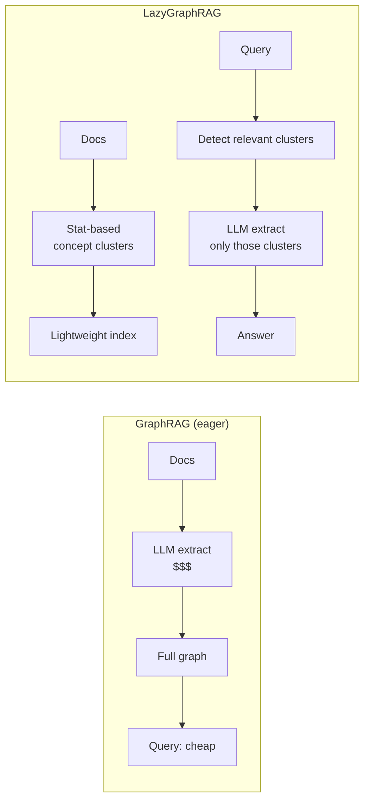

# Defer the Expensive Work

LazyGraphRAG ([Microsoft Research, Nov 2024](https://www.microsoft.com/en-us/research/blog/lazygraphrag-setting-a-new-standard-for-quality-and-cost/)) attacks the cost problem head-on: skip the up-front LLM extraction, and only do graph-style work for queries that need it.

## The trade

| | GraphRAG (eager) | LazyGraphRAG |
|---|---|---|
| Index cost | High (LLM per chunk) | Low (statistical only) |
| First query latency | Low | Higher (extracts at query time) |
| Subsequent queries on same area | Low | Low (cached extraction) |
| Quality on global queries | Strong baseline | Comparable or better in Microsoft's eval |
| Best for | Corpora you'll query many times | Corpora where most data is never queried |

Microsoft reports LazyGraphRAG matching GraphRAG quality at **0.1% of the indexing cost** on their benchmarks — and *exceeding* it on some categories of global queries.

## Why it works

Two insights:

1. **The graph is over-extracted in eager GraphRAG.** Most chunks contribute entities that no query ever asks about. The LLM work was wasted.
2. **Statistical concept clusters are good enough as a routing index.** You don't need a *correct* graph to know which slice of the corpus is relevant — embedding clustering plus a small bag-of-concepts works.

The actual graph extraction happens *at query time*, only over the chunks the router pulled in. Result: cheaper overall, especially on long-tail corpora.

## When eager still wins

- **You will query the corpus thousands of times.** Amortizing the index cost is fine
- **You need offline analytical workloads** ("show me the dependency graph") that benefit from the full graph existing
- **Latency-sensitive global queries.** Lazy approaches pay an LLM-extraction cost at query time; that's hard to hide

## Implementation notes

As of mid-2026 there is no official open-source LazyGraphRAG. The technique is described well enough in the [Microsoft blog post](https://www.microsoft.com/en-us/research/blog/lazygraphrag-setting-a-new-standard-for-quality-and-cost/) to reproduce; several community implementations exist with varying maturity.

Sources

- [Microsoft Research — LazyGraphRAG blog](https://www.microsoft.com/en-us/research/blog/lazygraphrag-setting-a-new-standard-for-quality-and-cost/)
- [Edge et al. — original GraphRAG (for comparison)](https://arxiv.org/abs/2404.16130)
