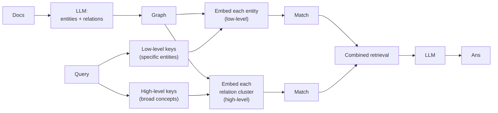

# Dual-Level Retrieval

LightRAG ([Guo et al. 2024](https://arxiv.org/abs/2410.05779)) is a simpler, cheaper alternative to microsoft/graphrag with explicit dual-level retrieval and easier incremental updates.



## The dual-level idea

Most queries have **two retrieval needs at once**:

- **Specific** — "the Postgres outage on March 14" (low-level: specific entities)
- **Broad** — "outages in Q1" (high-level: temporal/category clusters)

LightRAG indexes both. The LLM rewrites the query into *low-level* and *high-level* keys; the retriever does **two** searches and merges the results.

## What's different vs microsoft/graphrag

| | microsoft/graphrag | LightRAG |
|---|---|---|
| Community detection | Yes (Leiden) | No |
| Hierarchical | Multiple levels | Two fixed levels |
| Incremental insert | Painful | First-class |
| Indexing cost | High | ~50% of microsoft/graphrag |
| Code complexity | Higher | Lower |

LightRAG's main contribution isn't a new algorithm — it's a **cheaper, simpler pipeline** that hits similar accuracy with less infrastructure.

## Incremental updates

LightRAG was designed with continuous corpora in mind. Adding a document:

1. Extract entities and relations from the new doc only
2. Find existing entities that match (string + embedding)
3. Merge; emit updated descriptions for affected nodes
4. Re-embed only the affected nodes

No global re-clustering, no community re-summarization. This is the main reason teams pick LightRAG over GraphRAG for live systems.

## Reference implementation

```python
from lightrag import LightRAG, QueryParam

rag = LightRAG(
    working_dir="./graph_storage",
    llm_model_func=claude_complete,        # any OpenAI-compatible / custom
    embedding_func=openai_embed_3_large,
)

# Indexing
await rag.ainsert(open("docs/2026-q1-report.md").read())

# Query — pick mode per call
ans = await rag.aquery("Tell me about Alice's role change",
                        param=QueryParam(mode="local"))
ans = await rag.aquery("Recurring themes from Q1 incidents",
                        param=QueryParam(mode="global"))
ans = await rag.aquery("Both",  # uses dual-level
                        param=QueryParam(mode="hybrid"))
```

Sources

- [Guo et al. — LightRAG paper](https://arxiv.org/abs/2410.05779)
- [HKUDS/LightRAG — official implementation](https://github.com/HKUDS/LightRAG)
