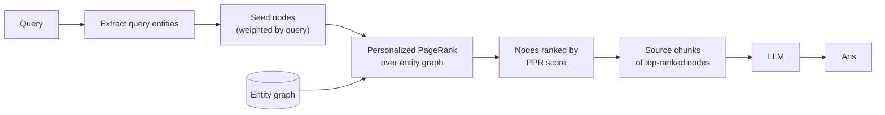

# Memory Inspired by the Hippocampus

HippoRAG ([Gutiérrez et al. 2024](https://arxiv.org/abs/2405.14831)) borrows from neuroscience: the brain's hippocampus does pattern separation and pattern completion to retrieve memories. HippoRAG implements an analog using **Personalized PageRank** over an entity graph.

## How PageRank fits

[Personalized PageRank](https://nlp.stanford.edu/IR-book/html/htmledition/topic-specific-pagerank-1.html) is the same algorithm that ranks web pages, but biased toward "seed" nodes. With seeds set to the entities in the user's query, the algorithm gives high scores to **entities reachable from many of the query's seeds** — a graph-aware notion of relevance.

This handles **multi-hop questions naturally**: if you ask about Alice and Q3 launches, entities that connect to both bubble up to the top.

## What's different

| | microsoft/graphrag | HippoRAG |
|---|---|---|
| Index | Communities + summaries | Just the entity graph |
| Retrieval | Map-reduce over communities | PageRank traversal |
| Indexing cost | High | Moderate |
| Multi-hop quality | Good (via global search) | Particularly strong |
| Code complexity | Higher | Lower |

In the paper's eval, HippoRAG **outperforms vector RAG and matches or beats GraphRAG on multi-hop benchmarks** (HotpotQA, MuSiQue, 2WikiMultiHopQA), at a fraction of the indexing cost — because there are no community summaries to compute.

## Mechanism in one paragraph

Extract entities and relations from the corpus as usual. At query time, extract entities from the *query*; use them as Personalized PageRank seeds; run a few iterations; rank nodes by score; fetch source chunks for the top-K. Pass to the LLM.

## When to reach for HippoRAG

- The query mix is heavy on multi-hop reasoning
- The corpus has lots of cross-entity relationships
- You want graph behavior without community-summarization overhead

When *not* to:

- The corpus is small enough that vector RAG isn't a bottleneck
- Queries are mostly point lookups
- You need explicit "themes across the corpus" — HippoRAG doesn't summarize communities

Sources

- [Gutiérrez et al. — HippoRAG paper (2024)](https://arxiv.org/abs/2405.14831)
- [Personalized PageRank explainer](https://nlp.stanford.edu/IR-book/html/htmledition/topic-specific-pagerank-1.html)
- [OSU-NLP-Group/HippoRAG — official repo](https://github.com/OSU-NLP-Group/HippoRAG)
