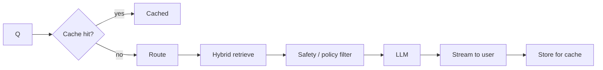

# Vector + Graph + Keyword

In production, almost no one runs GraphRAG **alone**. The winning pattern is hybrid: a vector index, a graph index, and (often) a keyword index — combined by a small ranker.

```mermaid
flowchart TB
    Q[Query] --> Router{Router<br/>(LLM or rules)}
    Router -->|local| V[Vector ANN]
    Router -->|specific entity| G[Graph traversal]
    Router -->|exact term| K[BM25 keyword]
    V & G & K --> Merge[Reciprocal rank fusion]
    Merge --> Rerank["Cross-encoder rerank<br/>(optional)"]
    Rerank --> LLM
```

## Why hybrid wins

Each index makes a different kind of mistake:

- **Vector** — misses exact-match terms ("error code E_421"); fails on numerical or code-like content
- **Graph** — depends on entity extraction quality; fails on truly novel entities not yet in the graph
- **Keyword** — exact-string fragile; brittle to paraphrase

Combining them recovers most failures. The standard merger is [**reciprocal rank fusion**](https://plg.uwaterloo.ca/~gvcormac/cormacksigir09-rrf.pdf): take the top-K from each retriever, score documents by `Σ 1 / (k + rank_i)`, sort. No tuning needed.

## Routing — when do you need graph at all?

A simple classifier (or a tiny LLM call) per query is cheap:

```python
ROUTE_PROMPT = """Classify the user's query into ONE of:
- local: asks about a specific entity or document
- global: asks for themes, summaries, or aggregations across the corpus
- factual: needs an exact value, name, code, or identifier

QUERY: {query}
"""

route = classify(query)
match route:
    case "local":   return graph_local_search(query)
    case "global":  return graph_global_search(query)
    case "factual": return hybrid(vector, keyword)(query)
```

In practice, **70% of queries are "factual" or "local" lookups** for which vector or vector+keyword is sufficient. Save graph for the global / multi-hop slice.

## Production reference architecture



Most teams that ran GraphRAG in 2024–25 ended up with this shape by 2026.

Sources

- [Cormack et al. — Reciprocal Rank Fusion (SIGIR 2009)](https://plg.uwaterloo.ca/~gvcormac/cormacksigir09-rrf.pdf)
- [Anthropic — Contextual Retrieval](https://www.anthropic.com/news/contextual-retrieval)
- [Microsoft GraphRAG — query routing examples](https://github.com/microsoft/graphrag)
