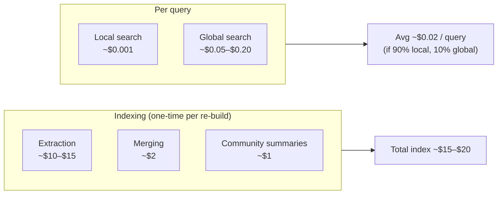

# What Does GraphRAG Actually Cost?

GraphRAG's LLM-heavy indexing is the headline cost. Concrete numbers for a 10 million-token corpus using Claude Haiku 4.5 (~$1 / $5 per M tokens, May 2026):

## Indexing breakdown

| Stage | Why it costs that |
|-------|-------------------|
| Entity + relation extraction | 1 LLM call per chunk × 10k chunks |
| Gleaning (1 round) | Another 30% of chunks |
| Description merging | ~1 call per merged entity, fewer than total |
| Community detection | Cheap (algorithmic, no LLM) |
| Community summarization | ~1 call per community per level (~64 calls) |

**Most of the cost is extraction.** Halving the gleaning rounds, dropping low-information chunks, or using a smaller extraction model are the highest-leverage cost cuts.

## Per-query cost

Local: a few thousand tokens of context, one LLM call. **Cents at most.**

Global: scales with number of communities at the chosen level. **5–20¢ per query** is typical. This is where most of the operational cost lives in production.

## How to cut cost

| Lever | Magnitude |
|-------|-----------|
| Use Haiku for extraction, not Opus | 5–10× |
| Skip gleaning, single-pass extraction | 1.3× |
| Drop chunks below a relevance threshold | 1.5–2× |
| Cache global-query results by semantic hash | depends on traffic |
| Switch to LazyGraphRAG (extract on demand) | ~1000× on index, 2–5× on query |
| Switch to LightRAG (no community summaries) | 1.5–2× on index |

## When the math doesn't work out

If your traffic is < 100 queries/day and your corpus is < 100k tokens, **don't use GraphRAG**. The indexing cost dominates per-query value. A naive vector RAG is fine.

If your traffic is > 10k queries/day with significant global-query mix, the indexing cost amortizes well — and the bottleneck shifts to query-time cost. That's when caching and LazyGraphRAG start mattering.

Sources

- [Anthropic — Claude pricing](https://www.anthropic.com/pricing)
- [Microsoft Research — LazyGraphRAG cost analysis](https://www.microsoft.com/en-us/research/blog/lazygraphrag-setting-a-new-standard-for-quality-and-cost/)
