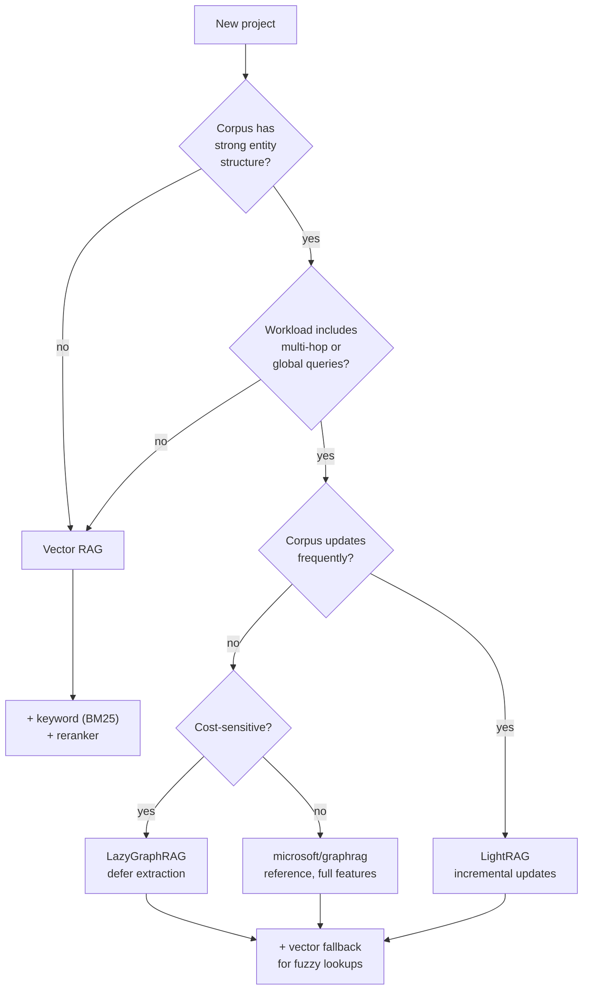

# Picking the Right Retrieval Strategy

## Decision questions in plain English

### Does your corpus have entity structure?

Yes for: customer records, code repos, knowledge bases, research libraries, project documents.
No (mostly) for: blog posts, marketing copy, fiction, unstructured chat logs.

### Do users ask multi-hop or global questions?

Look at real traffic. Sample 100 queries; classify. If <10% are non-local, GraphRAG's indexing cost is hard to justify.

### How often does the corpus change?

Daily: LightRAG or a custom incremental pipeline.
Weekly+: any GraphRAG works; re-index nightly is fine.
Mostly static: even eager microsoft/graphrag is reasonable.

### Cost-sensitive?

How much is "$10–$50 per index pass + few cents per query" worth to the answer-quality lift? For internal-tool quality bars, often nothing. For customer-facing search with measurable retention impact, often a lot.

## Common combinations seen in production

| Use case | Pattern |
|----------|---------|
| Internal docs Q&A | Vector + keyword, no graph |
| Code understanding agent | Vector + graph (via AST) + keyword |
| Legal/research review | LightRAG hybrid with citations |
| Customer-support routing | Vector RAG + small rule layer; graph for analytics |
| Org-wide knowledge agent | LazyGraphRAG with vector fallback |

## A practical test

Before committing to GraphRAG, do this:

1. Build a vector-RAG baseline. Measure quality with LLM-judge on 50 real queries
2. Hand-annotate the 10 worst failures
3. Could those failures be answered by traversing entities or summarizing communities? If yes → GraphRAG is the right next investment. If no → fix retrieval ranking or chunking instead

Sources

- [Edge et al. — GraphRAG eval methodology](https://arxiv.org/abs/2404.16130)
- [Anthropic — RAG without the cargo cult](https://www.anthropic.com/news/contextual-retrieval)
