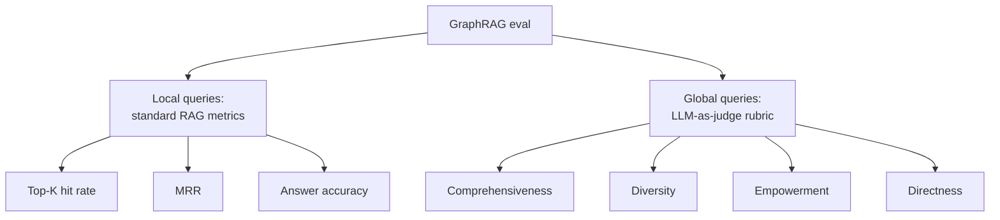

# How to Measure GraphRAG

Standard RAG eval (top-K hit rate, MRR) doesn't capture what GraphRAG promises. Global queries don't have a single "correct passage" to retrieve.



## The four global-query rubric dimensions

Microsoft's eval ([Edge et al. §4.3](https://arxiv.org/abs/2404.16130)) uses LLM-as-judge to score answers on four dimensions:

- **Comprehensiveness** — does the answer cover the breadth of the question?
- **Diversity** — does it surface multiple perspectives where applicable?
- **Empowerment** — does it help the user understand and reason further?
- **Directness** — does it answer the question, or wander?

The judge gets *both* answers (baseline vs GraphRAG) and picks a winner per dimension. Aggregate wins gives you the per-dimension lift.

## Building your own eval set

You can't evaluate what you can't measure. To get a real number:

1. **Sample 100–200 real queries** from production logs (anonymized)
2. **Classify each by question type** (local fact, multi-hop, global summary, etc.)
3. **Hand-label "good" answers** for ~30 of them (the expensive step)
4. **Run baselines and variants** through the same questions
5. **Score with LLM-as-judge** using a fixed rubric. Use a different model from the one being evaluated, to avoid bias

For local queries, you can use exact-match or contains-match on the hand-labeled answer. For global queries, use the four-dimension rubric.

## What to watch for

- **Eval contamination** — if your judge model trained on the corpus you're evaluating, scores are inflated
- **Question shape skew** — your eval should match the production query mix, not be all global queries
- **Cost per eval run** — running 200 queries × 4 systems × LLM-judge is real money. Cache aggressively

## A minimal eval harness

```python
@dataclass
class EvalCase:
    query: str
    type: Literal["local", "global", "multi_hop"]
    gold_answer: str | None = None

async def eval_run(systems: dict[str, RAGSystem], cases: list[EvalCase]):
    results = []
    for case in cases:
        answers = {name: await sys.answer(case.query) for name, sys in systems.items()}
        for name, ans in answers.items():
            score = await judge(case, ans)
            results.append({"system": name, "case": case.query, **score})
    return results
```

Sources

- [Edge et al. — §4.3 Eval methodology](https://arxiv.org/abs/2404.16130)
- [Ragas — open-source RAG eval framework](https://github.com/explodinggradients/ragas)
- [Anthropic — evaluating LLM applications](https://docs.claude.com/en/docs/test-and-evaluate/develop-tests)
