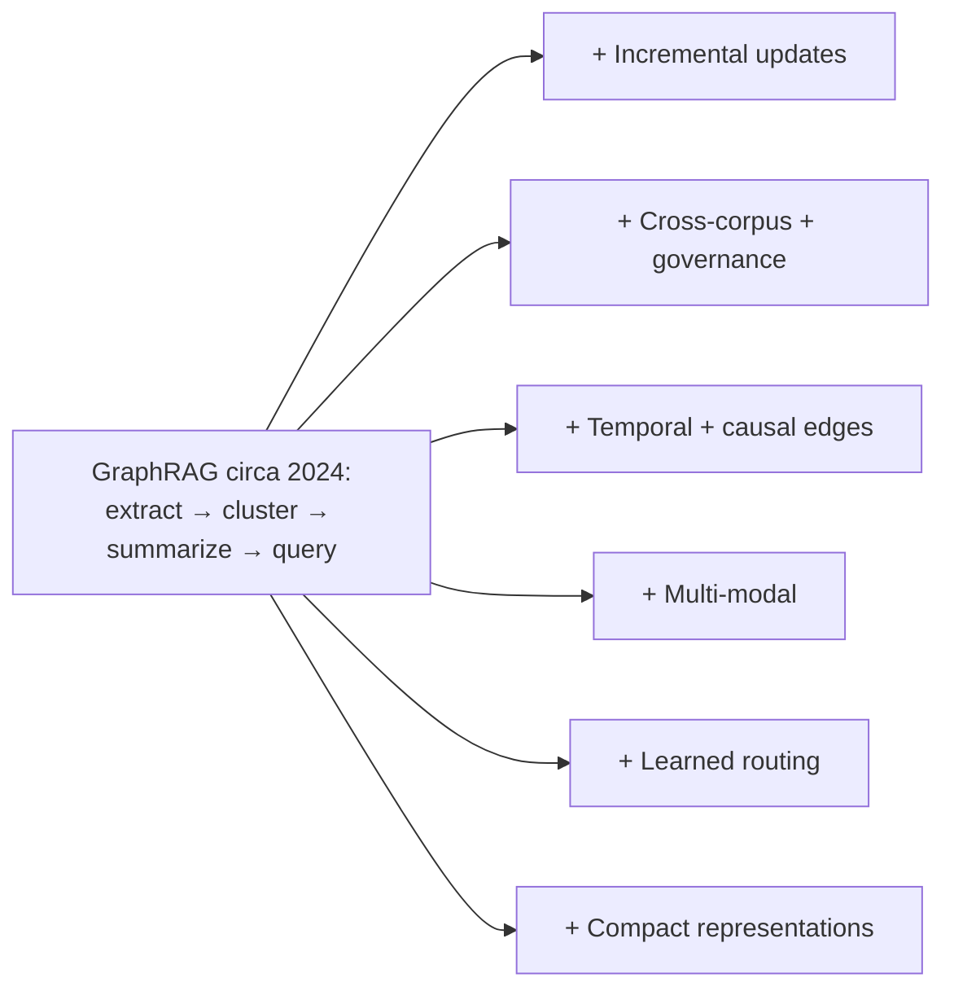

# Open Problems and Active Research

GraphRAG circa 2024 was a single technique. By 2026 it's an active research area with several open fronts.

## Incremental and streaming GraphRAG

The biggest practical gap: efficient updates. LightRAG's per-doc incremental is a start; LazyGraphRAG sidesteps the problem differently; nobody has cracked "continuous streaming corpora with sub-second update latency to the graph". Active work in 2026 papers.

## Cross-corpus graphs

Most graphs are per-corpus, per-tenant. A common ask in enterprise: "graph that spans my internal wiki, my customer-support tickets, and my code." Tooling for safe cross-corpus graphs (auth, deduplication, governance) is immature.

## Causal and temporal edges

Today's GraphRAG edges are mostly co-occurrence: "Alice and Bob are mentioned together." Causal edges ("the postponement of Project X caused the reorg of Team Y") and temporal edges ("Alice managed Bob from Jan to Aug; now Alice reports to Carol") are not first-class. Several papers in 2025 propose typed relation extraction with temporal grounding.

## Multi-modal graphs

The text-extraction pipeline ignores images, diagrams, code, tables. A diagram in a slide deck *is* a graph; extracting and merging it with the text graph is open. The 2026 frontier models that handle high-resolution vision ([Claude Opus 4.7](https://www.anthropic.com/news/claude-opus-4-7)) make this newly tractable.

## Learned routing

The "local vs global" router is usually hand-tuned. Several papers propose learning the router from query/answer pairs, with measurable gains on heterogeneous workloads.

## Compact graph representations

A 5M-node graph doesn't fit in a context window. Current approaches summarize communities; future approaches might **compress the graph itself** into a learned representation that the model can attend to directly. Early work on this is promising but very early.

## What you can take to industry now

- **microsoft/graphrag** for static, single-corpus, batch-indexed
- **LightRAG** for incremental and cost-sensitive
- **HippoRAG** for multi-hop-heavy workloads
- **Hybrid with vector + keyword** in all cases
- A **measured eval harness** in all cases

Sources

- [Edge et al. — GraphRAG paper](https://arxiv.org/abs/2404.16130)
- [Microsoft Research — LazyGraphRAG](https://www.microsoft.com/en-us/research/blog/lazygraphrag-setting-a-new-standard-for-quality-and-cost/)
- [Guo et al. — LightRAG](https://arxiv.org/abs/2410.05779)
- [Gutiérrez et al. — HippoRAG](https://arxiv.org/abs/2405.14831)
