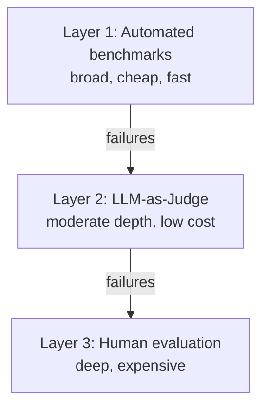

# The Three-Layer Evaluation Architecture

Modern evaluation stacks are layered: each layer is broader and cheaper than the next, and each one's failures feed deeper, more expensive review.

- **Layer 1 -- Automated benchmarks**: broad and cheap. Run on every change; catch obvious regressions across many cases.
- **Layer 2 -- LLM-as-Judge**: moderate depth at low cost. Score the cases that pass Layer 1 against rubrics; surface subtler quality issues.
- **Layer 3 -- Human evaluation**: deep but expensive. Reserve for the ambiguous, high-stakes, or judge-disagreement cases that Layer 2 flags.

Each layer feeds its failures to the next, so expensive human attention is spent only where cheaper layers cannot decide.

## From Model-Level to System-Level Evaluation

2026 frameworks have shifted from scoring individual responses to scoring **full agent pipelines end-to-end**:

- **End-to-end task success**: did the system actually complete the user's goal?
- **Tool-call correctness**: were the right tools called with the right arguments?
- **Latency and cost**: operational quality is now a first-class eval metric, not an afterthought

A model that produces great individual answers can still fail as a system -- wrong tool, too slow, too expensive. Evaluate the pipeline, not just the response.

## Sources

- [LLM Evaluation Frameworks: 2025 vs 2026 -- The Three-Layer Architecture (MLAI Digital)](https://www.mlaidigital.com/blogs/llm-evaluation-frameworks-2025-vs-2026-what-matters-now-2026)
- [The Best LLM Evaluation Tools of 2026 -- System-Level Evaluation (Online Inference)](https://medium.com/online-inference/the-best-llm-evaluation-tools-of-2026-40fd9b654dce)
