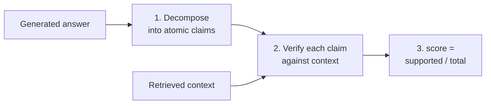

# Faithfulness

## Is the Answer Grounded in the Retrieved Context?

Faithfulness is the single most important metric for RAG systems. A high faithfulness score means the LLM is not hallucinating beyond the provided context.

## How RAGAS Computes Faithfulness



**Step 1: Claim Decomposition**
The LLM breaks the generated answer into individual atomic claims.

```
Answer: "Paris is the capital of France. It has a population
         of 2.1 million and was founded in the 3rd century BC."

Claims: [
  "Paris is the capital of France",
  "Paris has a population of 2.1 million",
  "Paris was founded in the 3rd century BC"
]
```

**Step 2: Claim Verification**
Each claim is checked against the retrieved context for support.

```
Context mentions: capital status (YES), population (YES),
                  founding date (NO -- not in context)

Supported: 2 / 3
```

**Step 3: Score Calculation**

```
Faithfulness = number_of_supported_claims / total_claims
Faithfulness = 2 / 3 = 0.67
```

## Interpreting Faithfulness Scores

- **1.0**: Every claim in the answer is supported by context (ideal)
- **0.7-0.9**: Mostly grounded, some minor additions
- **< 0.5**: Significant hallucination -- the model is inventing information

## Common Causes of Low Faithfulness

- Context is retrieved but the model ignores it and relies on parametric knowledge
- The model over-elaborates with details not in the retrieved chunks
- Incorrect summarization or paraphrasing that changes meaning

## Sources

- [RAGAS: Automated Evaluation of Retrieval Augmented Generation (Es et al., 2023)](https://arxiv.org/abs/2309.15217)
- [RAGAS Documentation — Faithfulness](https://docs.ragas.io)
