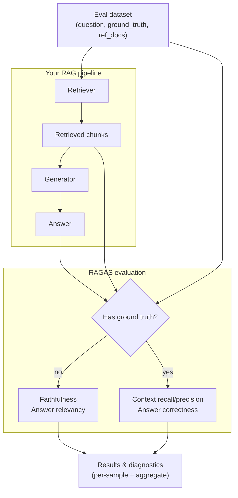

# End-to-End RAG Evaluation Pipeline

**Key point**: You need four columns of data -- question, answer, contexts, and (optionally) ground_truth -- to run the full RAGAS evaluation suite.

## Sources

- [RAGAS: Automated Evaluation of Retrieval Augmented Generation (Es et al., 2023)](https://arxiv.org/abs/2309.15217)
- [RAGAS Documentation](https://docs.ragas.io)
