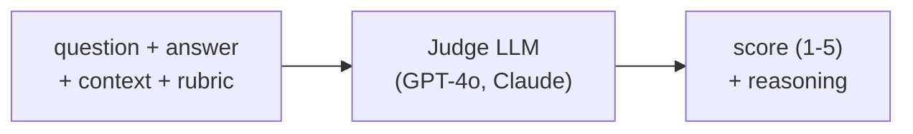

# LLM-as-a-Judge

## Using One LLM to Evaluate Another

## The Core Idea

Instead of writing heuristic scoring functions or hiring human annotators, use a capable LLM to read an output and score it against defined criteria.

## Why This Works

- Large LLMs have internalized human preferences from RLHF training
- They can follow detailed rubrics consistently across thousands of examples
- They provide natural language explanations for their scores (auditable)
- They can evaluate subjective qualities (tone, helpfulness) that rules can't capture

## The Key Insight

**RAGAS already does this under the hood.** Every RAGAS metric uses an LLM as a judge to decompose claims, verify support, and assess relevance. LLM-as-a-Judge is the engine powering modern automated evaluation.

## When to Use LLM-as-a-Judge

- Evaluating open-ended generation where there's no single "right answer"
- Assessing subjective qualities: helpfulness, tone, clarity, safety
- Scaling evaluation beyond what human reviewers can handle
- Running evaluation in CI/CD pipelines on every code change

## Sources

- [Judging LLM-as-a-Judge with MT-Bench and Chatbot Arena (Zheng et al., 2023)](https://arxiv.org/abs/2306.05685)
- [RAGAS: Automated Evaluation of Retrieval Augmented Generation (Es et al., 2023)](https://arxiv.org/abs/2309.15217)
