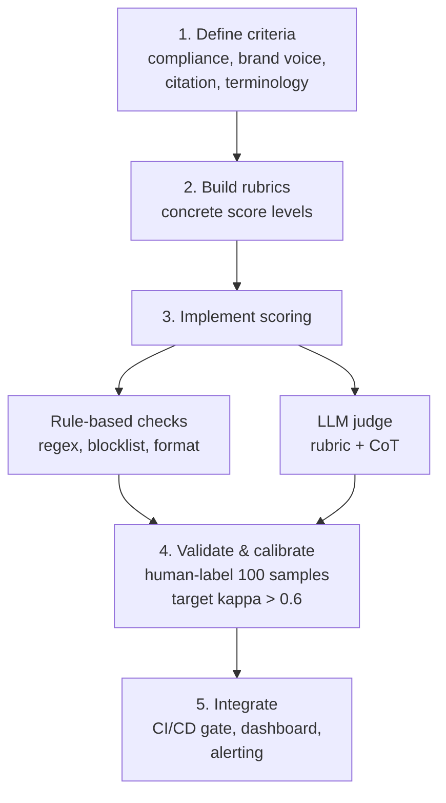

# Building Custom Evaluation Pipelines

## When off-the-shelf metrics don't cover your domain requirements.



**Template for custom LLM judge metric:**

```python
CUSTOM_JUDGE_PROMPT = """
You are evaluating a {domain} AI assistant.
Criterion: {criterion_name}
Definition: {criterion_definition}
Rubric:
  5 - {score_5_description}
  3 - {score_3_description}
  1 - {score_1_description}

Question: {question}
Context: {context}
Answer: {answer}

First explain your reasoning, then provide your score (1-5).
Output JSON: {"reasoning": "...", "score": N}
"""
```
