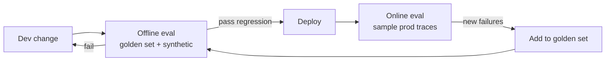

# Offline vs Online Evaluation

## Two complementary strategies for different stages of the development lifecycle.

## Offline (Pre-Deployment)

**When**: Before shipping changes.

**What you evaluate**:
- Fixed test datasets (golden set + synthetic)
- Known question-answer pairs with ground truth
- Controlled conditions, reproducible results

**How**:
- RAGAS / DeepEval on curated eval sets
- Regression tests in CI/CD
- A/B comparisons of prompt variants
- Red-teaming for safety and edge cases

**Strengths**:
- Reproducible and comparable across versions
- Catches regressions before users see them
- Can test adversarial and edge cases safely

**Weakness**:
- Doesn't reflect real user behavior
- Dataset can become stale

## Online (Production Monitoring)

**When**: After deployment, continuously.

**What you evaluate**:
- Real user queries and actual system responses
- Production traffic patterns and edge cases
- User satisfaction signals

**How**:
- Sample and score production traces with LLM judges
- Collect implicit feedback (thumbs up/down, follow-ups)
- Monitor retrieval quality metrics on live queries
- Track latency, error rates, and fallback rates

**Strengths**:
- Reflects actual user experience
- Catches issues offline eval missed
- Discovers new query patterns

**Weakness**:
- Users see failures before you catch them
- Noisier signals, harder to debug

---

**Best practice**: Gate deployments on offline eval (must pass regression tests), then monitor online eval for the first 24-48 hours after every release.
