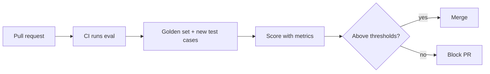

# Regression Testing

## Ensuring Changes Don't Break Existing Behavior

## The Problem

You improve your prompt for one type of question. Three other question types silently degrade. Without regression testing, you won't know until users complain.



## Setting Up Regression Tests

```python
# eval/test_regression.py
import json
from deepeval import assert_test
from deepeval.metrics import FaithfulnessMetric, AnswerRelevancyMetric

GOLDEN_SET = json.load(open("eval/golden_set.json"))

METRICS = [
    FaithfulnessMetric(threshold=0.7),
    AnswerRelevancyMetric(threshold=0.7),
]

def test_regression_suite():
    for case in GOLDEN_SET:
        output = rag_pipeline(case["question"])
        test_case = LLMTestCase(
            input=case["question"],
            actual_output=output["answer"],
            retrieval_context=output["contexts"],
            expected_output=case.get("ground_truth")
        )
        assert_test(test_case, METRICS)
```

## CI/CD Integration

```yaml
# .github/workflows/eval.yml
eval-regression:
  runs-on: ubuntu-latest
  steps:
    - uses: actions/checkout@v4
    - run: pip install -r requirements.txt
    - run: deepeval test run eval/test_regression.py
      env:
        OPENAI_API_KEY: ${{ secrets.OPENAI_API_KEY }}
    - run: python eval/compare_to_baseline.py
```

## Tracking Metrics Over Time

- Store eval results as JSON artifacts alongside each commit/PR
- Compare current scores against the last release baseline
- Set **absolute thresholds** (faithfulness must be > 0.7) AND **relative thresholds** (faithfulness must not drop > 5% from baseline)
- Alert on regressions, block merges that fail eval

## What to Include in Your Golden Set

- **High-frequency queries**: The 50 most common real user questions
- **Known failure cases**: Questions that broke in the past (prevent re-occurrence)
- **Edge cases**: Ambiguous queries, multi-hop questions, out-of-scope questions
- **Safety tests**: Prompt injection attempts, requests for harmful content
- **Format diversity**: Short questions, long questions, multi-part questions

## Sources

- [DeepEval GitHub Repository](https://github.com/confident-ai/deepeval)
