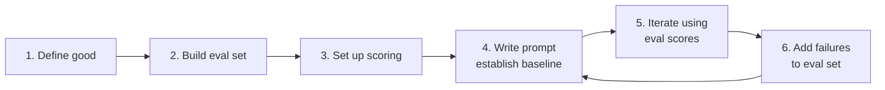

# Eval-Driven Development

## Write Evals Before Writing Prompts

## The Methodology

Eval-driven development (EDD) is test-driven development (TDD) for LLM applications. Just as TDD says "write the test first, then write the code," EDD says:

> **Write the eval first, then write the prompt.**

## The EDD Loop

1. **Define what "good" looks like** for your use case (criteria + rubrics)
2. **Build your eval dataset** (50-100 examples covering key scenarios)
3. **Set up automated scoring** (RAGAS / DeepEval / custom judge)
4. **Write your first prompt** and run evals -- establish a baseline
5. **Iterate on the prompt** using eval scores as your guide
6. **Add failure cases** to the eval set as you discover them
7. **Repeat** for every prompt change, model swap, or pipeline modification

## Why EDD Works

- **Prevents overfitting to anecdotes**: You optimize for aggregate performance, not cherry-picked examples
- **Makes tradeoffs visible**: Improving one dimension while degrading another shows up immediately
- **Enables confident refactoring**: Swap models, change chunking strategies, restructure prompts -- evals tell you if it's better
- **Compounds over time**: Your eval set becomes a living specification of your system's requirements

## Anti-Patterns to Avoid

- **Eval after the fact**: Building evals only after problems appear in production
- **Optimizing for the eval**: Overfitting prompts to pass specific test cases rather than genuinely improving quality
- **Stale datasets**: Never updating your eval set as your application evolves
- **Single-metric obsession**: Optimizing one metric (e.g., faithfulness) while ignoring others (e.g., helpfulness)
- **No baseline**: Making changes without recording the previous eval scores for comparison

## The EDD Manifesto

- Evals are **first-class artifacts**, versioned and reviewed like code
- Every prompt change requires an **eval run** before merge
- Eval results are **shared and visible** to the whole team
- **Failures are features**: every production bug becomes a new test case
