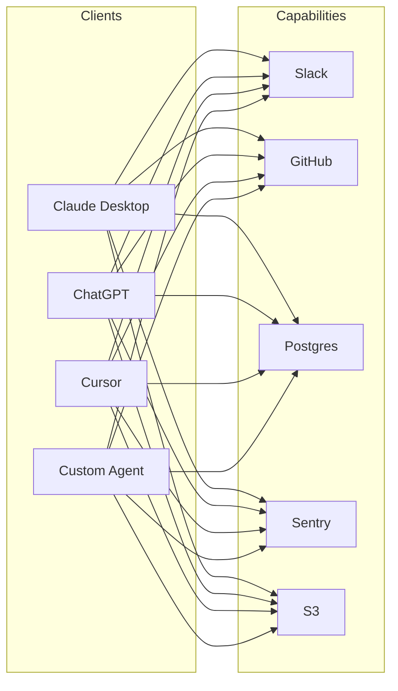

# The N×M Integration Problem

Every LLM application that takes action needs the same plumbing: connect the model to tools, files, databases, APIs. Each integration is bespoke — different SDK, different auth, different schema. With **N** clients (Claude, ChatGPT, Cursor, Continue, custom apps) and **M** capabilities (Slack, GitHub, Postgres, Sentry, S3, …), the industry was on its way to writing **N × M** integrations.

Every line is a custom integration: bespoke SDK glue, auth flow, error handling, schema documentation. The total cost grows multiplicatively.

## What this looks like in practice

- OpenAI function-calling JSON for GPT, Anthropic tool-use schema for Claude, LangChain Tool subclass for the framework path
- Auth code duplicated per integration (OAuth flow for Slack, PAT for GitHub, connection string for Postgres)
- Each new application starts from scratch — none of the prior glue is reusable

Sources

- [Anthropic — Introducing the Model Context Protocol](https://www.anthropic.com/news/model-context-protocol)
- [USB analogy popularized in the MCP launch announcement](https://www.anthropic.com/news/model-context-protocol)
