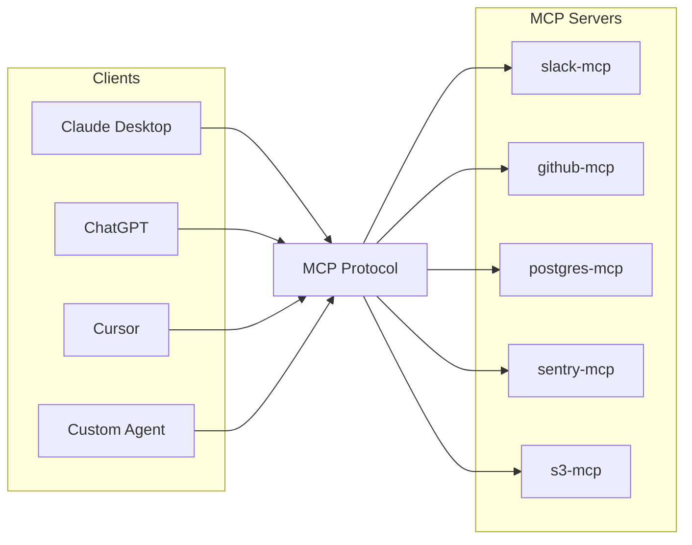

# One Protocol, Many Endpoints

MCP collapses the N×M problem into **N + M**: each client speaks MCP once, each capability is exposed as an MCP server once. New clients pick up every existing server for free; new servers light up across every existing client.

## What MCP actually is

- **An open protocol** — specification at [modelcontextprotocol.io](https://modelcontextprotocol.io), maintained by Anthropic with a multi-vendor governance group
- **A wire format** — JSON-RPC 2.0 over stdio, HTTP, or streamable HTTP transports
- **A capability model** — three primitives (tools, resources, prompts) that cover the common patterns, plus negotiated extensions
- **Not a framework** — no opinion about your agent loop, model choice, language, or runtime

## Why now

- Frontier models can reliably emit structured tool calls; the bottleneck shifted from model capability to integration surface area
- Agentic patterns (long-running workflows, multi-step tool use) require composable, swappable capability bundles, not bespoke wiring
- An open standard avoids vendor lock-in for downstream tool authors

Sources

- [MCP Specification](https://modelcontextprotocol.io/specification)
- [Anthropic — Introducing the Model Context Protocol (Nov 2024)](https://www.anthropic.com/news/model-context-protocol)
