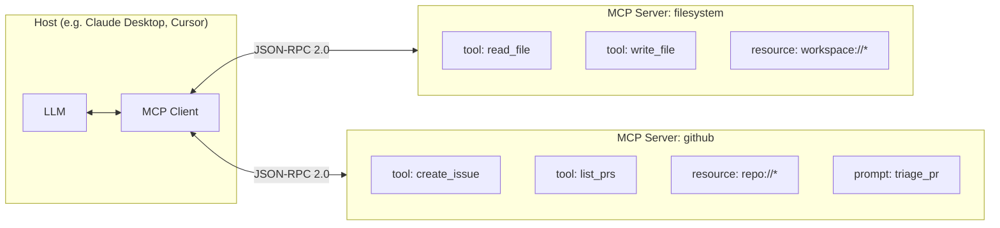

# USB-C for AI Applications

The MCP team's preferred analogy: **MCP is to AI applications what USB-C is to consumer electronics** — a single physical and logical connector that any host can talk to and any peripheral can expose.

## Three roles

- **Host** — the application the user sees. Owns the model, the conversation, and the user trust boundary. Examples: Claude Desktop, Cursor, an internal chatbot
- **MCP Client** — one per server connection, lives inside the host. Negotiates capabilities and forwards JSON-RPC messages
- **MCP Server** — a process (local or remote) that exposes one or more primitives. Owns the capability's auth, rate limits, and execution

## Compared to a familiar stack

| Layer | Web | MCP |
|-------|-----|-----|
| Protocol | HTTP | MCP (JSON-RPC 2.0) |
| Endpoint | URL | Server |
| Verb | GET/POST | tool / resource / prompt |
| Discovery | OpenAPI / sitemap | `tools/list`, `resources/list`, `prompts/list` |
| Auth | OAuth, bearer | OAuth (RFC 8252), env, or per-server scheme |

Sources

- [MCP Specification — Architecture](https://modelcontextprotocol.io/specification/architecture)
- [MCP Specification — Core Concepts](https://modelcontextprotocol.io/specification/architecture#concepts)
