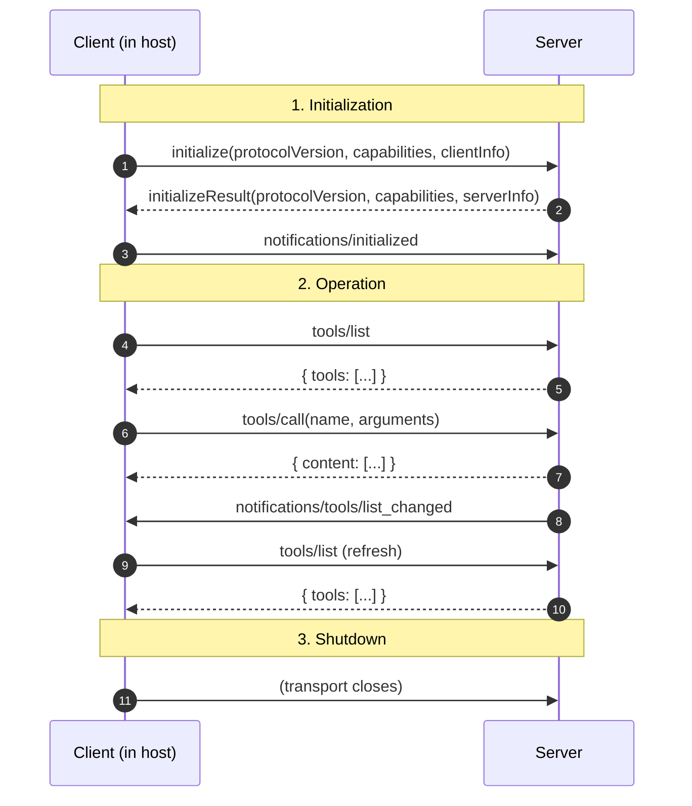

# Initialize, Use, Shut Down

Every MCP connection follows the same three-phase lifecycle. The handshake is where the client and server agree on which features they both support — there is no global "MCP version compatibility matrix" the client has to track.

## What gets negotiated at `initialize`

- **`protocolVersion`** — both sides advertise the most recent MCP version they understand; they fall back to the lower one if they differ
- **`capabilities`** — feature flags both sides need to agree on:
  - Server side: `tools`, `resources`, `prompts`, `logging`, `experimental`, plus whether each supports change notifications
  - Client side: `sampling` (will the client run the model on a server's behalf?), `roots` (does the client expose workspace roots?)
- **`clientInfo` / `serverInfo`** — name + version strings, used for telemetry and bug reports, not for routing

## Why the explicit `notifications/initialized`

A client sends it after `initialize` returns to signal "I'm done negotiating, you can start sending notifications now." Without it, a server emitting `tools/list_changed` before the client had finished registering its handlers would drop the event.

Sources

- [MCP — Lifecycle](https://modelcontextprotocol.io/specification/2025-03-26/basic/lifecycle)
- [MCP — Server Capabilities](https://modelcontextprotocol.io/specification/2025-03-26/server)
