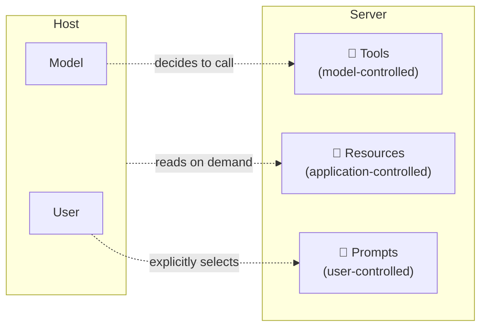

# Tools, Resources, Prompts

MCP servers expose capability via three primitives. Each is **controlled by a different party** — that distinction matters more than the primitives themselves, because it determines who decides when the capability runs.

## At a glance

| Primitive | Who triggers it | Typical use | Side effects |
|-----------|-----------------|-------------|--------------|
| **Tool** | The model | "Send a Slack message", "Run this SQL query" | Yes — anything the tool says it does |
| **Resource** | The host application | Read a file, fetch a record, list issues | No — read-only, idempotent |
| **Prompt** | The user (or the host on their behalf) | "Triage this PR", "Write a release note" | No — it's a template + context bundle |

## Why split it three ways

If everything were a tool, the model would have to decide when to read every file, and prompts (which are just well-known templates) would inflate the tool list. The split keeps the **model's attention surface** focused on actions, while resources and prompts route through the host's deterministic logic.

- A 50-file workspace exposes one `read_file` *tool* — not 50 tools, one per file — and the actual files appear as *resources*
- A "weekly report" template is a *prompt* the user can pick from a menu, not a tool the model is supposed to "decide" to use

Sources

- [MCP — Tools](https://modelcontextprotocol.io/specification/2025-03-26/server/tools)
- [MCP — Resources](https://modelcontextprotocol.io/specification/2025-03-26/server/resources)
- [MCP — Prompts](https://modelcontextprotocol.io/specification/2025-03-26/server/prompts)
