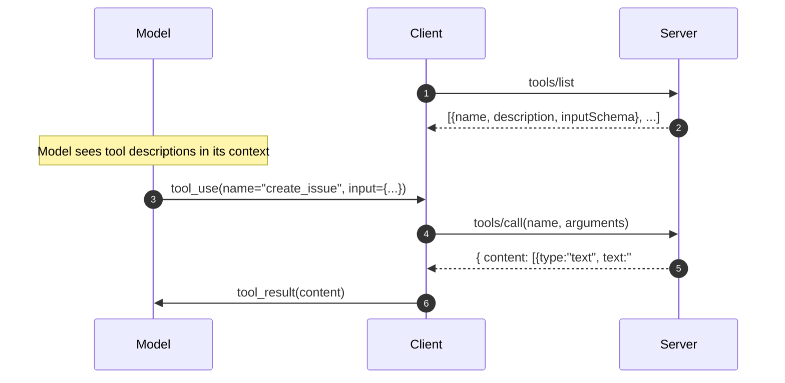

# Tools — Model-Controlled Actions

A **tool** is a server-defined function the model can decide to call. The model sees a name, description, and JSON Schema for inputs; the host runs the call and feeds the result back into the conversation.



## Tool declaration

```json
{
  "name": "create_issue",
  "description": "Open a new issue in a GitHub repo. Returns the issue number and URL.",
  "inputSchema": {
    "type": "object",
    "properties": {
      "repo":   {"type": "string", "description": "owner/name"},
      "title":  {"type": "string"},
      "body":   {"type": "string"},
      "labels": {"type": "array", "items": {"type": "string"}}
    },
    "required": ["repo", "title"]
  }
}
```

## Calling a tool (Python server side)

```python
from mcp.server import Server
from mcp.types import Tool, TextContent

app = Server("github-mcp")

@app.list_tools()
async def list_tools() -> list[Tool]:
    return [Tool(name="create_issue", description="...", inputSchema={...})]

@app.call_tool()
async def call_tool(name: str, arguments: dict) -> list[TextContent]:
    if name == "create_issue":
        issue = await gh.create_issue(**arguments)
        return [TextContent(type="text", text=f"#{issue.number} {issue.html_url}")]
```

## Design rules

- **Tool descriptions are read by the model.** Write them for the model the way you'd write API docs for a junior engineer
- **Return rich content.** `tool_result` accepts text, images, and embedded resources — use the right block type
- **Surface errors with `isError: true`.** The model uses this to decide whether to retry, ask the user, or stop
- **Keep tools coarse-grained.** A `query_sales(filters)` tool with 6 args usually beats 6 narrow tools the model has to compose

Sources

- [MCP — Tools spec](https://modelcontextprotocol.io/specification/2025-03-26/server/tools)
- [MCP Python SDK examples](https://github.com/modelcontextprotocol/python-sdk)
- [Anthropic — Tool use best practices](https://docs.claude.com/en/docs/agents-and-tools/tool-use/overview)
