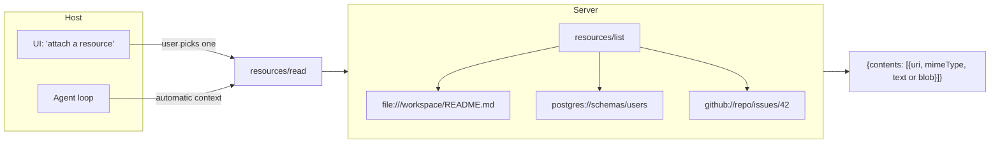

# Resources — Application-Controlled Data

A **resource** is a read-only handle to data the server can produce. Each resource has a URI; the host decides when to fetch it and whether to put it into the model's context.



## Resource declaration

```json
{
  "uri": "file:///workspace/CONTRIBUTING.md",
  "name": "CONTRIBUTING.md",
  "mimeType": "text/markdown",
  "description": "Project contribution guide"
}
```

## Reading a resource

```json
// Request
{"jsonrpc":"2.0", "id": 9, "method": "resources/read",
 "params": {"uri": "file:///workspace/CONTRIBUTING.md"}}

// Response — mimeType drives whether content is text or base64 blob
{"jsonrpc":"2.0", "id": 9, "result": {
  "contents": [{"uri": "...", "mimeType": "text/markdown", "text": "# Contributing\n..."}]
}}
```

## When to expose data as a resource vs as a tool

| Question | Use a **resource** | Use a **tool** |
|----------|--------------------|-----------------|
| Is it read-only? | Yes | Maybe |
| Does the *user* (not the model) usually pick it? | Yes | No |
| Should the host be able to surface it in a UI list? | Yes | No |
| Does the model need to *compute* something to get it? | No | Yes |

A SQL `SELECT` against an arbitrary schema is a **tool** (the model is composing the query). A pre-canned "yesterday's sales summary" pulled by URI is a **resource**.

## Subscriptions

Servers can advertise `resources/subscribe` so a host can be notified (`notifications/resources/updated`) when a resource changes — useful for live dashboards or files-on-disk.

Sources

- [MCP — Resources spec](https://modelcontextprotocol.io/specification/2025-03-26/server/resources)
- [MCP — URI scheme guidance](https://modelcontextprotocol.io/specification/2025-03-26/server/resources#uri-templates)
