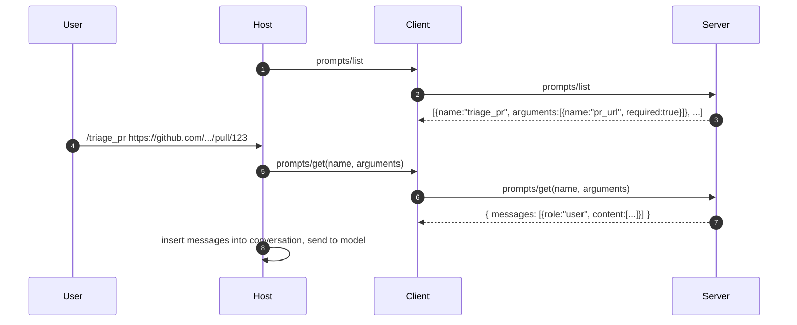

# Prompts — User-Controlled Templates

A **prompt** is a parameterized message template the *user* picks (typically from a UI menu like a slash command). The server fills it in with current context and returns a `messages` array the host inserts into the conversation.



## Prompt declaration

```json
{
  "name": "triage_pr",
  "description": "Review a pull request and post a triage comment.",
  "arguments": [
    {"name": "pr_url", "description": "Full GitHub PR URL", "required": true}
  ]
}
```

## `prompts/get` returns *messages*, not a string

```json
{"messages": [
  {"role": "user", "content": [
    {"type": "text", "text": "Triage this PR. Check tests, scope, security:"},
    {"type": "resource", "resource": {"uri": "github://repo/pulls/123/diff", ...}}
  ]}
]}
```

Two things are happening here:
1. The server has already **fetched and embedded the diff as a resource** — the model doesn't have to ask
2. The server can return **multi-turn** messages (a few-shot exchange) if that's what the template needs

## Why prompts as a primitive

It would be tempting to ship templates as documentation. But making them a first-class primitive lets hosts:

- Render them as a `/`-prefixed slash command, button, or menu in the UI
- Cache them, hot-reload them on `notifications/prompts/list_changed`
- Audit them — who's using which template, with what arguments

Sources

- [MCP — Prompts spec](https://modelcontextprotocol.io/specification/2025-03-26/server/prompts)
- [Claude Desktop slash commands example](https://modelcontextprotocol.io/quickstart/user)
