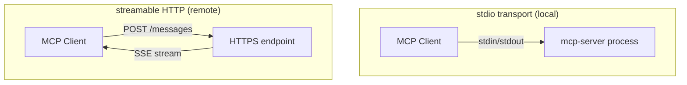

# Stdio and Streamable HTTP

MCP defines the message envelope; the transport defines how those messages move between client and server. Two transports are standardized; the same servers run unchanged across either.

## stdio — for local servers

The host spawns the server as a subprocess. JSON-RPC messages flow over stdin/stdout, one per line. Server logs go to stderr.

- Zero infrastructure — no port, no auth handshake, no TLS
- The host owns the server's lifecycle (start on connect, kill on disconnect)
- Auth is **inherited from the parent process** — env vars, ~/.aws/credentials, local SSH keys

Used by every Claude Desktop, Cursor, and Continue MCP server you install today.

## Streamable HTTP — for remote and shared servers

A single HTTP endpoint that accepts POSTed JSON-RPC requests and replies with either a single JSON response or an SSE stream (for long-running calls or notifications).

- Servers can live anywhere — internal infra, SaaS, the public internet
- Auth is a proper concern: bearer tokens, OAuth 2.1 Authorization Code with PKCE, signed JWTs
- One server instance, many clients — useful for org-wide capabilities (corporate Slack server, shared knowledge graph)

The 2025-03-26 spec consolidated the earlier "HTTP+SSE" and "HTTP+streaming" variants into one **Streamable HTTP** transport.

## Transport decision matrix

| Situation | Transport |
|-----------|-----------|
| User-owned credentials, single-user app | stdio |
| Capability that needs server-side state shared across users | Streamable HTTP |
| Capability with high cold-start cost (loaded model, big index) | Streamable HTTP |
| Air-gapped or no-network environment | stdio |

Sources

- [MCP — Transports](https://modelcontextprotocol.io/specification/2025-03-26/basic/transports)
- [Streamable HTTP transport (March 2025)](https://modelcontextprotocol.io/specification/2025-03-26/basic/transports#streamable-http)
- [OAuth 2.1 (draft)](https://datatracker.ietf.org/doc/html/draft-ietf-oauth-v2-1-13)
