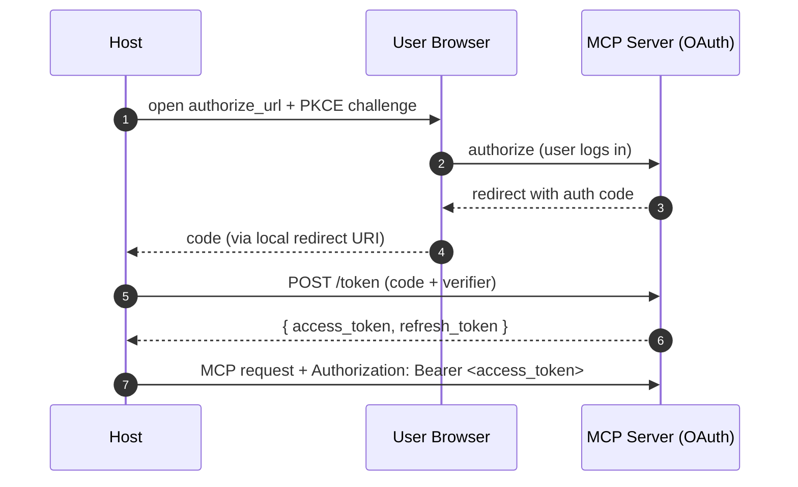

# Auth Belongs to the Transport

MCP itself has no opinion about authentication — the spec deliberately punts auth to the transport so servers can use the patterns their underlying API already supports.

## Stdio auth (the easy case)

The server inherits the user's environment from the host process. Most local servers look like:

```python
import os
slack = WebClient(token=os.environ["SLACK_BOT_TOKEN"])
```

The host's config file (Claude Desktop's `claude_desktop_config.json`, Cursor's settings) is where secrets are pinned. The host UI prompts the user to enter them once.

## Streamable HTTP auth: OAuth 2.1 + PKCE

For remote servers the spec recommends OAuth 2.1 with Authorization Code + PKCE, which gives you a real user-bound token without ever shipping a client secret.



## Practical auth patterns

| Capability type | Recommended auth |
|------------------|-------------------|
| Personal local tool (filesystem, git) | None — process-level |
| Personal SaaS (Slack, GitHub) | OAuth 2.1 + PKCE per user |
| Enterprise API gateway | mTLS or signed JWT |
| Read-only public data | Bearer token or none |
| Multi-tenant remote server | OAuth + scoped tokens per tenant |

## Pitfalls

- **Don't ship secrets through `params`.** Tokens belong in headers; the spec explicitly says request bodies are not the auth channel
- **Refresh tokens are the server's responsibility.** The host shouldn't have to re-authenticate every hour; the server SDK should rotate quietly
- **Audit logging is a server concern.** Don't rely on the host to log who called what — different hosts will log differently

Sources

- [MCP — Authorization](https://modelcontextprotocol.io/specification/2025-03-26/basic/authorization)
- [OAuth 2.1 + PKCE rationale (RFC 8252)](https://datatracker.ietf.org/doc/html/rfc8252)
