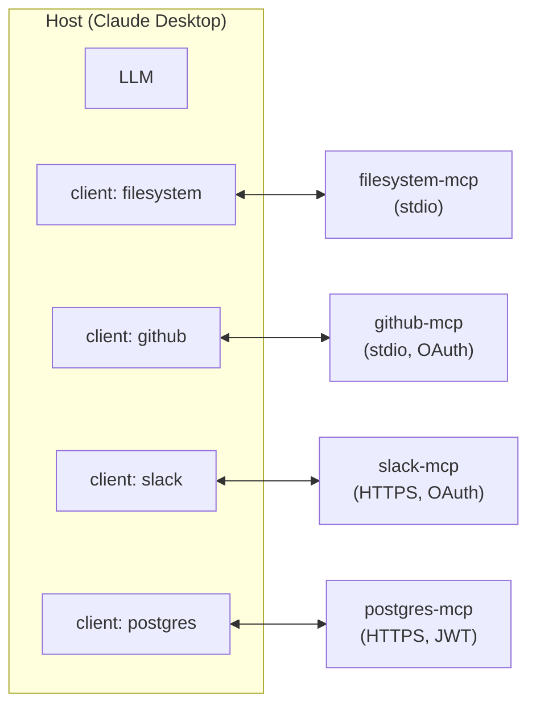

# A Host Talks to Many Servers

A single host can connect to many MCP servers at once. Each connection gets its own client; the host is responsible for namespacing and routing.



## How the host presents the union to the model

Each server independently advertises its tools, resources, and prompts. The host **merges and namespaces** them before showing the result to the model:

```
filesystem.read_file        ← from filesystem-mcp
github.create_issue         ← from github-mcp
slack.send_message          ← from slack-mcp
postgres.run_query          ← from postgres-mcp
```

Different hosts use different namespacing conventions (`server.tool`, `server__tool`, or none at all if names happen to be unique). The protocol doesn't mandate one.

## When tool counts get large

A power user can easily end up with 50+ tools across 8+ servers. Two patterns help:

- **Tool search** — the host indexes tool descriptions and surfaces only the top-K relevant ones to the model per turn. Anthropic's tool-search tool ([`tool_search_20260209`](https://docs.claude.com/en/docs/agents-and-tools/tool-use/tool-search-tool)) is one production example
- **Conditional capability loading** — connect to a server only when its scope is active (open a Slack server only when the user is in a "team chat" mode)

## Conflict resolution

- **Name collisions** — host responsibility; typical convention is `<server>.<tool>` or to reject the second registration
- **Resource URI conflicts** — namespacing by scheme (`s3://...` vs `file://...`) usually resolves this
- **Capability flag conflicts** — servers don't conflict with each other; each connection negotiates independently with the host

Sources

- [MCP — Architecture](https://modelcontextprotocol.io/specification/architecture)
- [Anthropic — Tool search tool](https://docs.claude.com/en/docs/agents-and-tools/tool-use/tool-search-tool)
