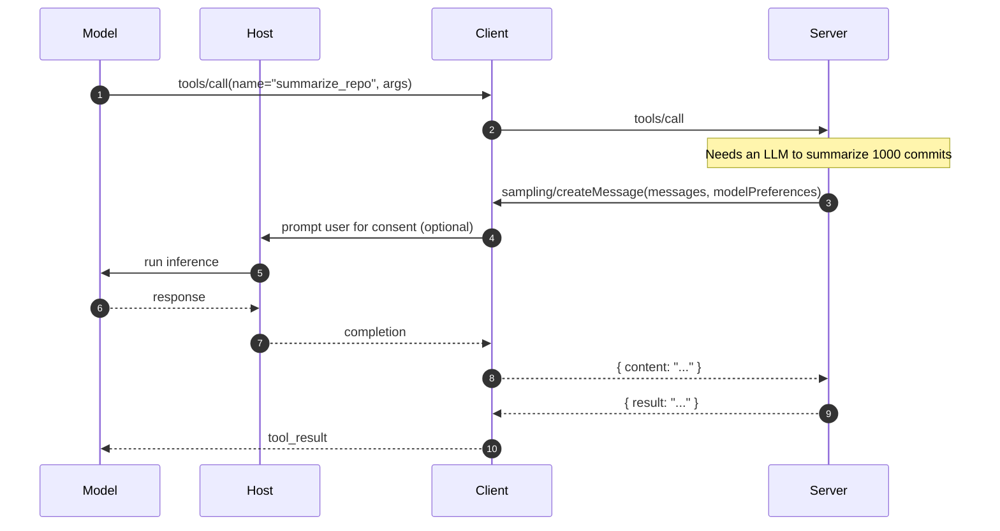

# When the Server Needs an LLM

A capability sometimes needs to call an LLM mid-execution — to summarize a long tool result, classify an item, or run a sub-reasoning step. Servers don't ship a model; they ask the **client** to do it via the `sampling/createMessage` request.



## Why bounce through the client

- **The user already paid for the model.** The host has the API key, rate limits, and billing; the server shouldn't need its own
- **Auditability.** Every model call goes through the same host, with the same logging, the same safety filters
- **User consent.** The client can prompt the user before the server's LLM call runs, especially if it would be expensive

## Sampling request shape

```json
{"method": "sampling/createMessage", "params": {
  "messages": [{"role": "user", "content": [{"type": "text", "text": "Summarize this..."}]}],
  "modelPreferences": {
    "hints": [{"name": "claude-haiku"}],
    "speedPriority": 0.7,
    "costPriority": 0.6,
    "intelligencePriority": 0.3
  },
  "systemPrompt": "Be concise.",
  "maxTokens": 500
}}
```

Note `modelPreferences` is advisory — the client picks the actual model. This is how a server can say "use the cheapest fast model" without hardcoding a vendor.

## Anti-patterns

- **Don't use sampling for the agent's *own* loop.** That's the host's job. Sampling is for capability internals (a parser, a re-ranker, a guard)
- **Don't loop on sampling.** If the server can do the same work with rules or a smaller deterministic model, prefer that — every sampling call is a user-visible cost

Sources

- [MCP — Sampling](https://modelcontextprotocol.io/specification/2025-03-26/client/sampling)
- [MCP — Model preferences](https://modelcontextprotocol.io/specification/2025-03-26/client/sampling#model-preferences)
