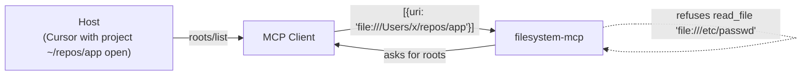

# Sandboxing the Filesystem

A **root** is a URI the client tells servers it has access to. It's how a filesystem-capable server learns *which* directory belongs to the current task — without the client having to leak its full file tree.

## How roots get used

- Client declares `roots` capability at `initialize`
- Server can call `roots/list` at any time to ask "what's currently in scope?"
- Server enforces the boundary itself — refuses reads/writes outside the advertised roots
- Client can change the active roots without disconnecting (notify via `notifications/roots/list_changed`)

## Why this is in the protocol

Without roots, every filesystem server would invent its own way to scope access: env vars, command-line flags, config files. With roots, the *host* — which knows what the user is currently working on — declares scope dynamically. Opening a different project in Cursor switches roots; the server just gets the new list.

## Roots aren't just directories

The URI scheme is open. Realistic examples:

- `file:///Users/me/repo` — the obvious one
- `github://owner/repo` — a GitHub repo handle for a server backed by the GitHub API
- `s3://bucket/prefix/` — a slice of an S3 bucket
- `postgres://db/schema.table` — a single table for a SQL server

The server decides which schemes it understands; the client declares which roots are active.

## Pitfalls

- **Don't bypass roots in your server's tool implementations.** If you accept arbitrary `path` arguments, validate them against the current roots
- **Roots are scope, not auth.** A server still needs its own auth check — roots tell you *where*, auth tells you *whether*

Sources

- [MCP — Roots](https://modelcontextprotocol.io/specification/2025-03-26/client/roots)
