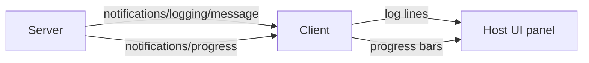

# Server-to-Host Telemetry

Two server-initiated notification streams give the host (and the user) visibility into what's happening inside a long-running tool call:



## Structured logging

```json
{"method": "notifications/logging/message", "params": {
  "level": "info",   // debug | info | notice | warning | error | critical | alert | emergency (syslog levels)
  "logger": "github-mcp.search",
  "data": {"query": "is:open", "elapsed_ms": 412}
}}
```

The client can subscribe with `logging/setLevel` so debug logs only flow when the user opens a dev panel. Hosts typically map level + logger to a filterable UI; servers don't have to know how it's rendered.

## Progress for long-running tools

```python
# Server side — Python SDK
@app.call_tool()
async def call_tool(name, args, ctx):
    if name == "index_codebase":
        files = list_repo_files(args["root"])
        for i, path in enumerate(files):
            await index_file(path)
            await ctx.report_progress(
                progress=(i + 1) / len(files),
                total=1.0,
                progressToken=args.get("_meta", {}).get("progressToken"),
            )
        return [...]
```

The `progressToken` is the client's correlation handle — the client decides whether to render a spinner, a determinate bar, or just an animated dot.

## What to log (and what not to)

- ✅ Tool execution metadata: name, args summary, latency, success/failure
- ✅ Backoff/retry events when the server is hitting an upstream API
- ❌ Full tool arguments containing PII — log a redacted summary
- ❌ Credentials or session tokens — ever
- ❌ Per-character LLM tokens — that's not what this channel is for

Sources

- [MCP — Logging](https://modelcontextprotocol.io/specification/2025-03-26/server/utilities/logging)
- [MCP — Progress](https://modelcontextprotocol.io/specification/2025-03-26/basic/utilities/progress)
- [RFC 5424 — syslog severity levels](https://datatracker.ietf.org/doc/html/rfc5424#section-6.2.1)
