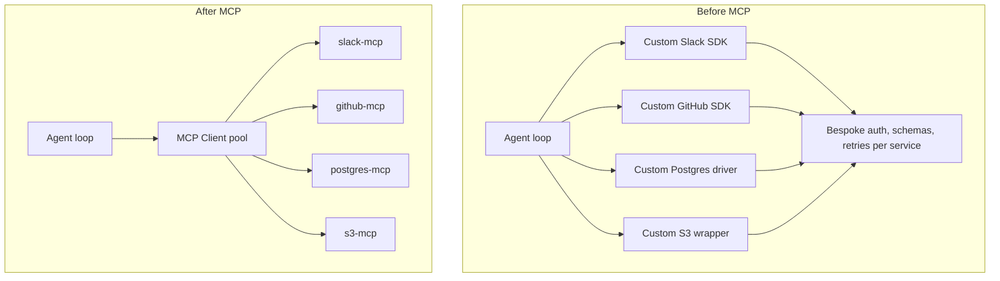

# How Agent Code Changes



## Custom integration code, before

```python
# Each integration is its own special case
slack_client = slack_sdk.WebClient(token=SLACK_TOKEN)
gh = github.Github(GITHUB_PAT)
pg = psycopg.connect(PG_URL)
s3 = boto3.client("s3")

tools = [
    {"name": "send_slack",   "input_schema": {...slack-specific...}},
    {"name": "create_issue", "input_schema": {...github-specific...}},
    {"name": "run_query",    "input_schema": {...sql-specific...}},
    {"name": "list_objects", "input_schema": {...s3-specific...}},
]

def execute_tool(name, args):
    if name == "send_slack":   return slack_client.chat_postMessage(**args)
    elif name == "create_issue": return gh.create_issue(**args)
    elif name == "run_query":   return pg.execute(args["sql"]).fetchall()
    elif name == "list_objects": return s3.list_objects_v2(**args)
```

## With MCP

```python
from mcp.client.session import ClientSession

# Each connection negotiates capabilities automatically
async with ClientSession(*await connect_stdio("slack-mcp")) as slack, \
           ClientSession(*await connect_stdio("github-mcp")) as gh, \
           ClientSession(*await connect_streamable_http("https://corp.io/postgres-mcp")) as pg:

    # The agent loop is one path for every capability
    tools = await collect_tools([slack, gh, pg])
    while True:
        result = await model.call(tools=tools)
        if not result.tool_calls: break
        for tc in result.tool_calls:
            client = route(tc.name)  # picks the right session
            tool_result = await client.call_tool(tc.name, tc.arguments)
            ...
```

## What you stopped writing

- A function per service that wraps its SDK
- A schema-per-tool that drifts from the upstream API
- Auth handling that's subtly different for each provider
- Retry/timeout/backoff policy duplicated everywhere

## What you didn't gain

- Better tool quality — the *individual* MCP servers still need to be well-written
- Free auth — OAuth still needs to be configured per remote server, just once instead of once per app
- Free safety — you still need policy at the host layer

Sources

- [Anthropic — MCP launch](https://www.anthropic.com/news/model-context-protocol)
- [MCP Python SDK quickstart](https://github.com/modelcontextprotocol/python-sdk)
