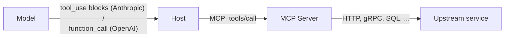

# Where MCP Fits

MCP is not the only way to give an LLM tools. It is one of several layers in a stack — each at a different abstraction level. Knowing which problem each one solves helps you avoid using MCP where it doesn't fit.

| Layer | What it standardizes | Example | When MCP is the better fit |
|-------|----------------------|---------|------------------------------|
| Vendor tool-use spec | How the *model* emits a function call | OpenAI function calling, Anthropic tool use | MCP rides on top — you still use these |
| App framework "tools" | How an SDK wraps tools for one app | LangChain Tools, LlamaIndex Tools, Vercel AI SDK | When tools should be reusable outside the framework |
| Plugin store | A vendor's curated tool marketplace | ChatGPT plugins (deprecated), Claude Apps | When you want the tool to work in *any* host, not one vendor's |
| RAG retriever | How to fetch context | LangChain Retriever, LlamaIndex Index | MCP resources are a thin substitute; full RAG is orthogonal |
| Agent runtime | Loop, memory, planning | LangGraph, AutoGen, Pydantic Graph | Different concern — MCP is the *capability* layer beneath them |

## OpenAI function calling vs MCP

Function calling is the format a model emits when it wants to call a tool. It says nothing about where the tool lives, how it's authenticated, or how to discover it. MCP fills in those gaps — and the MCP server's `tools/list` output gets translated into function-calling schemas before being shown to the model.

## LangChain Tools vs MCP

LangChain `Tool` classes are Python objects. They're great inside a Python app. But they don't help you share a tool with a colleague using TypeScript, or with Cursor, or with Claude Desktop. MCP is the cross-runtime equivalent — and there are MCP-to-LangChain adapters in both directions.

## Plugins vs MCP

ChatGPT plugins (and similar) were vendor-specific marketplaces: write a plugin, it works inside one product. MCP servers are vendor-neutral: write one, it works in any compatible host. The closest historical analog isn't plugins — it's [LSP](https://microsoft.github.io/language-server-protocol/), which freed editor tools from being tied to a specific IDE.

Sources

- [MCP — Architecture](https://modelcontextprotocol.io/specification/architecture)
- [LangChain MCP integration](https://python.langchain.com/docs/integrations/tools/mcp/)
- [LSP — the historical precedent](https://microsoft.github.io/language-server-protocol/)
