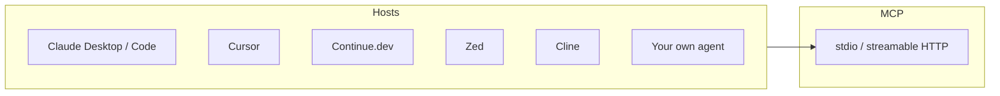

# What's Available Off-the-Shelf

By mid-2026 the MCP ecosystem has crossed the threshold where most common capabilities are one config-file edit away from being usable. The official and community server registries together list several thousand entries.

## Reference and high-quality community servers

| Capability | Server | Notes |
|------------|--------|-------|
| Filesystem | `@modelcontextprotocol/server-filesystem` | Reference; supports roots, glob |
| Git | `@modelcontextprotocol/server-git` | Read repo state, run `git log` |
| GitHub | `@modelcontextprotocol/server-github` | Issues, PRs, code search |
| Slack | `@modelcontextprotocol/server-slack` | OAuth, channel + DM send |
| Postgres | `@modelcontextprotocol/server-postgres` | Read-only schema + query |
| Puppeteer | `@modelcontextprotocol/server-puppeteer` | Browser automation |
| AWS / S3 | community | Object listing, signed URL gen |
| Notion | community | Page + DB CRUD |
| Sentry | community | Error reading, issue triage |
| Linear | official | Issue + project management |

Anthropic maintains an official list at [github.com/modelcontextprotocol/servers](https://github.com/modelcontextprotocol/servers). Several community-maintained registries exist on top of that (smithery, mcpservers.org).

## Hosts that speak MCP

## SDKs

- **Python** — [modelcontextprotocol/python-sdk](https://github.com/modelcontextprotocol/python-sdk), used by most data + ops servers
- **TypeScript** — [modelcontextprotocol/typescript-sdk](https://github.com/modelcontextprotocol/typescript-sdk), used by most editor-integration servers
- **Go** — [mark3labs/mcp-go](https://github.com/mark3labs/mcp-go), gaining traction for infra-side servers
- **Rust, C#, Java, Kotlin** — official or near-official SDKs, varying maturity

## Where the ecosystem is still rough

- **Multi-tenant SaaS MCP servers** — hosting one MCP endpoint that serves many users with per-user auth is still mostly DIY
- **Observability** — there is no standard tracing format for MCP calls (OTel work is in progress)
- **Permission policy** — no spec-level "fine-grained ACL"; each host invents its own

Sources

- [modelcontextprotocol/servers — official server list](https://github.com/modelcontextprotocol/servers)
- [Anthropic MCP servers blog post](https://www.anthropic.com/news/model-context-protocol)
