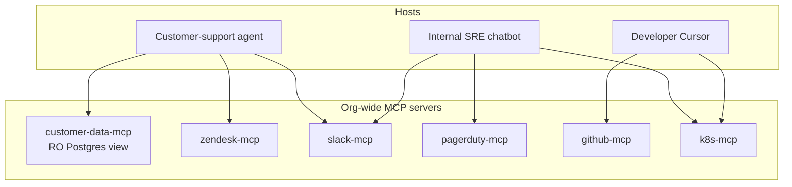

# How Production Teams Use MCP

A pattern emerging across early adopters: a small in-house **"capability portfolio"** of MCP servers, plus a thin host that picks the right subset per agent.

## Three production patterns

### 1. The "thin host" pattern

Each agent application is small; almost all logic lives in MCP servers. Switching agents from one model to another, or from one framework to another, doesn't require rewriting any capability — only swapping the host.

### 2. The "internal SDK" pattern

A platform team writes a handful of MCP servers wrapping the company's internal APIs (data warehouse, identity, deploy pipeline). Every product team consumes them. The protocol replaces what used to be a half-finished internal Python library.

### 3. The "MCP gateway" pattern

A single HTTPS endpoint multiplexes many backing services. Useful when you want centralized auth, audit, and rate limiting. The host sees one MCP server; the gateway routes to dozens.

## Lessons reported

- **Schema discipline matters more than you think.** Tool descriptions get cached in eval pipelines, in fine-tuning data, in user-facing docs. Treat them like a versioned API
- **Stdio is fine for personal tools; remote servers need real auth design.** OAuth + scoped tokens, not a long-lived bearer
- **Observability is the surprise effort.** Distributed tracing through MCP isn't built in; teams roll their own with the logging primitive or upstream OTel

## What's still hard

- Connecting an MCP server to an MCP **client** in the same process (instead of subprocess) — for embedded use cases. Several SDKs ship in-process helpers, but the patterns aren't standardized
- Hot-reloading a server's tools list without disconnecting — protocol supports it (`notifications/tools/list_changed`); most hosts implement it inconsistently

Sources

- [Anthropic — MCP launch blog](https://www.anthropic.com/news/model-context-protocol)
- [Block engineering — MCP at production scale](https://engineering.block.xyz/) (representative case study; verify current URL)
