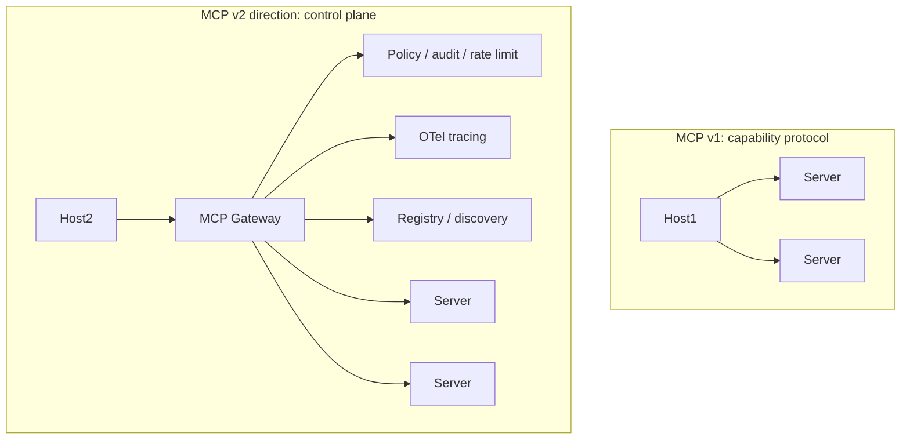

# MCP as a Control Plane

The first wave was about *connecting* an agent to capabilities. The second wave — visible in 2025 and accelerating in 2026 — is about MCP as the **control plane** for how those capabilities are governed, observed, and composed.

## Concrete directions

- **Standardized observability.** OpenTelemetry semantic conventions for MCP calls — `mcp.tool.name`, `mcp.server.name`, `mcp.duration_ms`, error categorization. Work-in-progress in the spec group as of late 2025
- **A vetted registry.** Today every host curates its own server list. A signed, versioned registry (think npm + Sigstore) would let a security team allow-list servers across the org
- **Composition spec.** Today servers are flat; a "supercapability" that internally calls other MCP servers (chains them) requires custom code. A composition primitive would make that declarative
- **Agent-to-agent.** MCP between two agents — one agent acts as a server, exposing some of its skills to another. Conceptually clean, currently uncommon
- **Streaming tool results.** Today `tools/call` returns a single response. Long-running tools that should stream intermediate output (a code-execution sandbox, a deep search) need this. Partial work in the streamable HTTP transport

## Things that probably won't happen

- **MCP swallowing RAG.** Resources are convenient for small static data; production RAG pipelines have requirements (chunking, embedding, query rewriting) that don't fit inside a primitive
- **MCP swallowing the agent loop.** The host owns the loop, and that's load-bearing — the host is where user trust and model choice live
- **A "MCP 2.0" rewrite.** The protocol is conservative by design; breaking changes are unlikely

## What to watch

- The MCP working group's monthly notes ([modelcontextprotocol/specification](https://github.com/modelcontextprotocol/specification))
- Anthropic, OpenAI, Google adoption beyond the desktop / IDE space — when LLM-as-a-service vendors expose MCP-native endpoints
- Hosting layer: cloudflare-style MCP "edge" hosting that serves servers without you running infra

Sources

- [MCP — Specification roadmap](https://github.com/modelcontextprotocol/specification)
- [OTel semantic conventions WG](https://github.com/open-telemetry/semantic-conventions)
