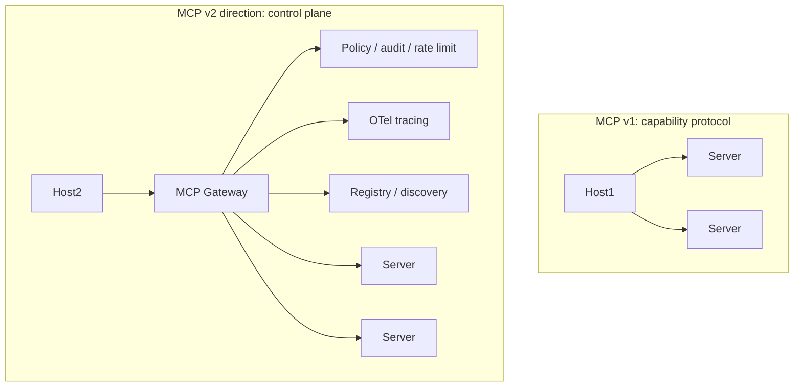

# MCP as a Control Plane

The first wave was about *connecting* an agent to capabilities. The second wave — visible in 2025 and accelerating in 2026 — is about MCP as the **control plane** for how those capabilities are governed, observed, and composed.

## The 2026 roadmap (published March 9, 2026)

The official roadmap names two priorities:

- **Priority 1 — Stateless Streamable HTTP.** Evolve the transport so servers scale horizontally without sticky sessions; any replica can serve any request, which is what production load balancers want
- **Priority 2 — MCP Server Cards.** A standard metadata + capability-discovery descriptor per server, so hosts and registries can introspect what a server offers before connecting

## MCP Apps (January 2026)

MCP Apps extends the protocol beyond text: tools can return **interactive UI components** — dashboards, forms, charts — that render directly in the conversation window. This matters for enterprise reporting and for workflow approval, where a human reviews a rendered form rather than a JSON blob.

## Other concrete directions

- **Standardized observability.** OpenTelemetry semantic conventions for MCP calls — `mcp.tool.name`, `mcp.server.name`, `mcp.duration_ms`, error categorization. Work-in-progress in the spec group as of late 2025
- **A vetted registry.** Today every host curates its own server list. A signed, versioned registry (think npm + Sigstore) would let a security team allow-list servers across the org — MCP Server Cards are a step toward this
- **Composition spec.** Today servers are flat; a "supercapability" that internally calls other MCP servers (chains them) requires custom code. A composition primitive would make that declarative
- **Agent-to-agent.** MCP between two agents — one agent acts as a server, exposing some of its skills to another. Conceptually clean, currently uncommon
- **Runtime optimization at scale.** Claude now ships **75+ built-in MCP connectors**, and Anthropic's **Tool Search** and **Programmatic Tool Calling** APIs let a host select and invoke the right tools efficiently when an agent is wired to hundreds of them

## Things that probably won't happen

- **MCP swallowing RAG.** Resources are convenient for small static data; production RAG pipelines have requirements (chunking, embedding, query rewriting) that don't fit inside a primitive
- **MCP swallowing the agent loop.** The host owns the loop, and that's load-bearing — the host is where user trust and model choice live
- **A "MCP 2.0" rewrite.** The protocol is conservative by design; breaking changes are unlikely

## What to watch

- The MCP working group's monthly notes ([modelcontextprotocol/specification](https://github.com/modelcontextprotocol/specification))
- Anthropic, OpenAI, Google adoption beyond the desktop / IDE space — when LLM-as-a-service vendors expose MCP-native endpoints
- Hosting layer: cloudflare-style MCP "edge" hosting that serves servers without you running infra

Sources

- [MCP — Specification roadmap](https://github.com/modelcontextprotocol/specification)
- [MCP 2026 roadmap (modelcontextprotocol.io)](https://modelcontextprotocol.io/development/roadmap)
- [MCP evolution, capabilities, and MCP Apps — ByteBridge](https://bytebridge.medium.com/model-context-protocol-mcp-evolution-capabilities-and-the-rise-of-peta-ff2967b45d48)
- [MCP complete guide 2026: built-in connectors, Tool Search, Programmatic Tool Calling — SurePrompts](https://docs.claude.com/en/docs/agents-and-tools/tool-use/tool-search-tool)
- [OTel semantic conventions WG](https://github.com/open-telemetry/semantic-conventions)
