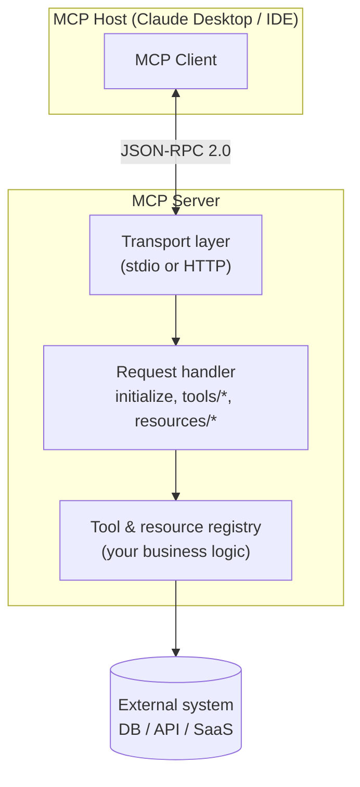

# Anatomy of an MCP Server

The SDK handles transport + request routing. **You implement the tools and resources.**

## Sources

- [MCP Specification](https://modelcontextprotocol.io)
- [MCP TypeScript SDK](https://github.com/modelcontextprotocol/typescript-sdk)
