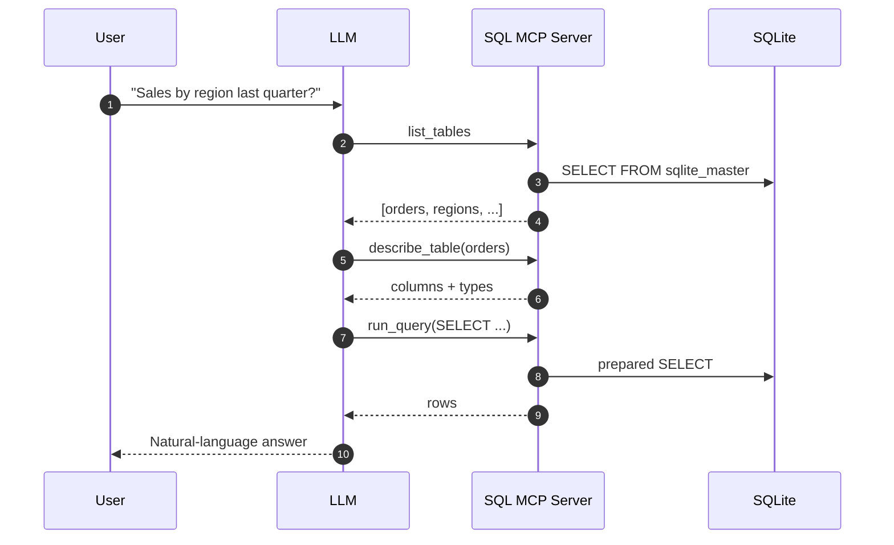

# SQL Track: The Goal

**Scenario:** You have a SQLite database with company data — employees, departments, sales records. You want to let an LLM answer questions like:

- "How many employees are in engineering?"
- "What were total sales last quarter by region?"
- "Show me the schema for the orders table"

**What you'll build:**

An MCP server that exposes 4 tools:

| Tool              | Purpose                                  |
|-------------------|------------------------------------------|
| `list_tables`     | Enumerate all tables in the database     |
| `describe_table`  | Get columns, types, and keys for a table |
| `run_query`       | Execute a read-only SELECT query         |
| `explain_query`   | Get the query execution plan             |

Plus resources for schema context that the host can preload.

**The LLM workflow:**
1. User asks a data question
2. LLM calls `list_tables` to discover what's available
3. LLM calls `describe_table` to understand the structure
4. LLM writes SQL and calls `run_query`
5. LLM interprets the results and answers the user

