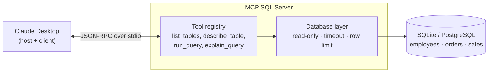

# SQL Server Architecture

```mermaid
flowchart LR
    Host["Claude Desktop<br/>(host + client)"]
    subgraph Server["MCP SQL Server"]
      Tools["Tool registry<br/>list_tables, describe_table,<br/>run_query, explain_query"]
      DBLayer["Database layer<br/>read-only · timeout · row limit"]
      Tools --> DBLayer
    end
    DB[("SQLite / PostgreSQL<br/>employees · orders · sales")]
    Host <-->|JSON-RPC over stdio| Tools
    DBLayer --> DB
```

All queries go through a **read-only connection** with timeout and row limits.
