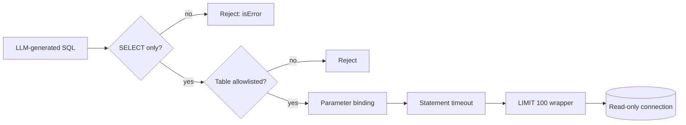

# SQL Safety Guardrails

An LLM generating SQL is powerful but dangerous. Layer your defenses:




**1. Read-only connection:**
```typescript
// SQLite: open in read-only mode
const db = await open({
  filename: DB_PATH,
  mode: sqlite3.OPEN_READONLY,
  driver: sqlite3.Database,
});
```

**2. Query validation — reject anything that isn't SELECT:**
```typescript
const forbidden = /\b(INSERT|UPDATE|DELETE|DROP|ALTER|CREATE|TRUNCATE|EXEC)\b/i;
if (forbidden.test(sql)) {
  return { content: [{ type: "text", text: "Only SELECT queries allowed." }], isError: true };
}
```

**3. Parameter binding — never interpolate user values into SQL:**
```typescript
// Good: parameterized
await db.all("SELECT * FROM orders WHERE region = ?", [region]);
// Bad: string interpolation
await db.all(`SELECT * FROM orders WHERE region = '${region}'`);
```

**4. Row limits — cap results to prevent context window overflow:**
```typescript
const LIMITED_SQL = `SELECT * FROM (${sql}) LIMIT 100`;
```

**5. Query timeout — kill long-running queries:**
```typescript
// Set a statement timeout (PostgreSQL)
await db.query("SET statement_timeout = '10s'");
```

**6. Table allowlisting (optional but recommended):**
```typescript
const ALLOWED_TABLES = new Set(["employees", "departments", "orders", "sales"]);
```
