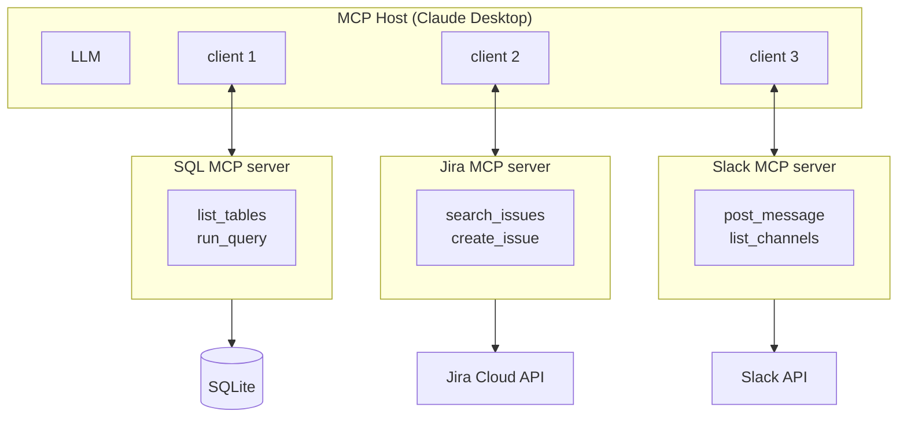

# Composing Multiple MCP Servers

An MCP host can connect to **multiple servers simultaneously**. Each server is independent — the LLM sees all tools from all servers and chooses which to call.

> "Find the Jira ticket about the sales drop, query the DB for Q4 numbers, and post a summary to #data-team."

**The LLM orchestrates across all three** — no custom integration code needed between the servers. This is the power of MCP's composability.
