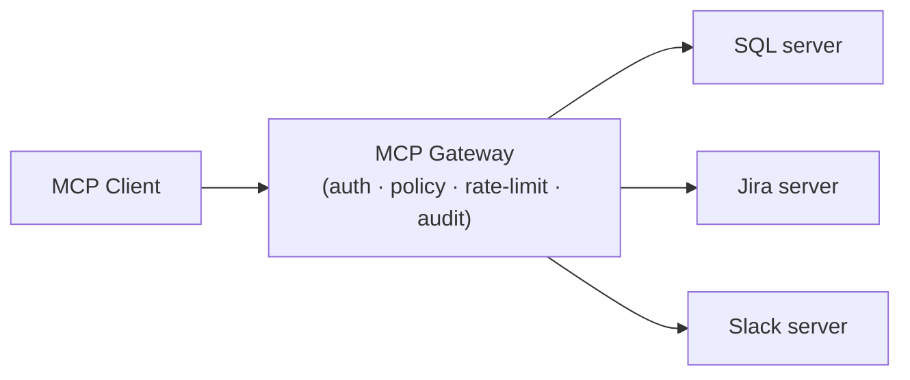

# Deploying MCP Servers

## Docker Container

```dockerfile
FROM node:22-slim
WORKDIR /app
COPY package*.json ./
RUN npm ci --production
COPY dist/ ./dist/

# For stdio transport (local):
ENTRYPOINT ["node", "dist/index.js"]

# For HTTP transport (remote):
# EXPOSE 3001
# CMD ["node", "dist/server.js"]
```

```bash
docker build -t my-mcp-server .
# stdio usage:
docker run -i my-mcp-server
# HTTP usage:
docker run -p 3001:3001 my-mcp-server
```

Stateless containers. Easy to version, rollback, and scale.

## Cloud Functions

Deploy each tool as a serverless function:

- **AWS Lambda** + API Gateway
- **Google Cloud Run** — container-based
- **Cloudflare Workers** — edge deployment

Good for low-traffic, bursty workloads. Pay per invocation. Cold starts can add latency.

Wrap the Streamable HTTP transport in your function handler.

## MCP Gateway Pattern

Run an enterprise **gateway** that sits between agents and servers, routing to multiple backends through a single governed control plane:



The gateway centralizes:
- Authentication and authorization
- **Tool-level access policies** — which agents may call which tools
- Rate limiting across all servers
- **Audit trails** capturing every tool invocation
- Traffic routing, server discovery, and health checks

This is the standard pattern for organizations managing many MCP servers across teams. Leading 2026 gateway products include **Bifrost**, **MintMCP**, and **Maxim**. The principle: every tool invocation should flow through a governed control plane rather than connecting agents directly to servers.

## npx / Registry

For open-source or shared servers:

```bash
# Publish to npm
npm publish

# Users run directly
npx @myorg/sql-mcp-server
```

Claude Desktop config:
```json
{
  "mcpServers": {
    "sql": {
      "command": "npx",
      "args": ["@myorg/sql-mcp-server"],
      "env": { "DB_URL": "..." }
    }
  }
}
```

Zero install for end users. Version pinning via npm.

## Sources

- [MCP TypeScript SDK](https://github.com/modelcontextprotocol/typescript-sdk)
- [MCP Specification](https://modelcontextprotocol.io)
- [MCP gateways for enterprise engineering — MintMCP](https://www.mintmcp.com/blog/gateways-enterprise-engineering-with-mcp)
