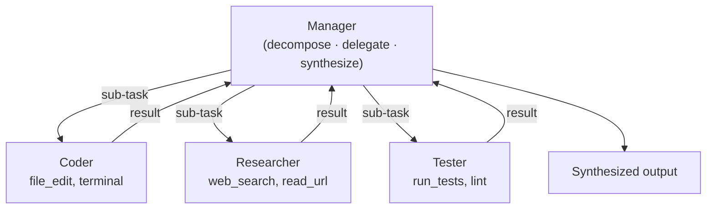

# Pattern 2: Hierarchical — Manager Delegates to Workers

A manager agent breaks down tasks and delegates to specialized workers.

## Key Design Decisions
- **Manager has NO tools** — it only plans, delegates, and synthesizes
- **Workers have NO planning ability** — they execute a specific sub-task
- Manager decides when the task is done or needs another iteration
- Workers report results back to the manager, not to each other

## When to Use
- Tasks requiring multiple distinct skills
- You want centralized control over workflow orchestration
- The manager can effectively decompose the problem
