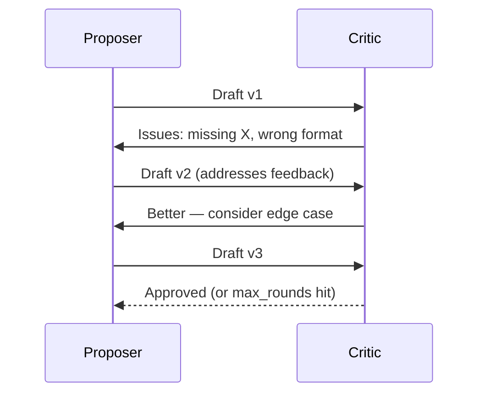

# Pattern 3: Collaborative — Peer Agents Discuss and Iterate

Agents communicate as peers, refining each other's work through rounds of feedback.

## How It Works
- Agents take turns producing and critiquing output
- Each round uses the previous round's feedback as input
- Terminates when critic approves, max rounds hit, or quality threshold met

## Strengths
- Produces higher-quality output through iterative refinement
- Natural fit for writing, code review, and design tasks
- Simple two-agent setup can be very effective

## Watch Out For
- Agents can get stuck in "polite loops" — always finding something to critique
- Set a **max iteration count** (typically 3-5 rounds)
- Define clear acceptance criteria so the critic knows when to stop
