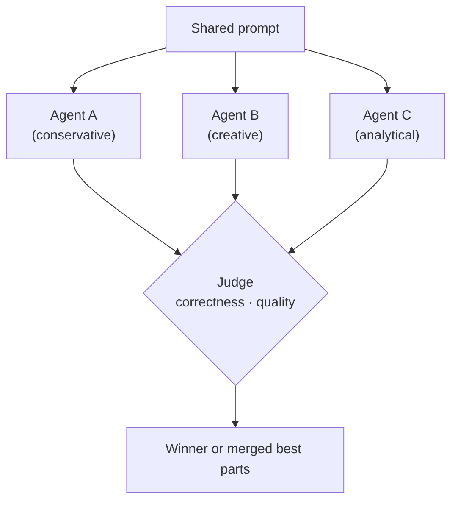

# Pattern 4: Competitive — Multiple Proposals, Best Wins

Multiple agents independently solve the same problem; a judge selects the best result.

## When to Use
- Problems with multiple valid approaches (creative tasks, architecture decisions)
- High-stakes outputs where diversity of thought reduces risk
- You can afford the extra compute cost (N parallel agent calls)

## Trade-offs
- **Pro:** Reduces variance — unlikely all agents make the same mistake
- **Pro:** Judge can merge the best parts of multiple proposals
- **Con:** N times the cost of a single agent
- **Con:** Judge must be capable of evaluating quality — non-trivial for complex tasks
