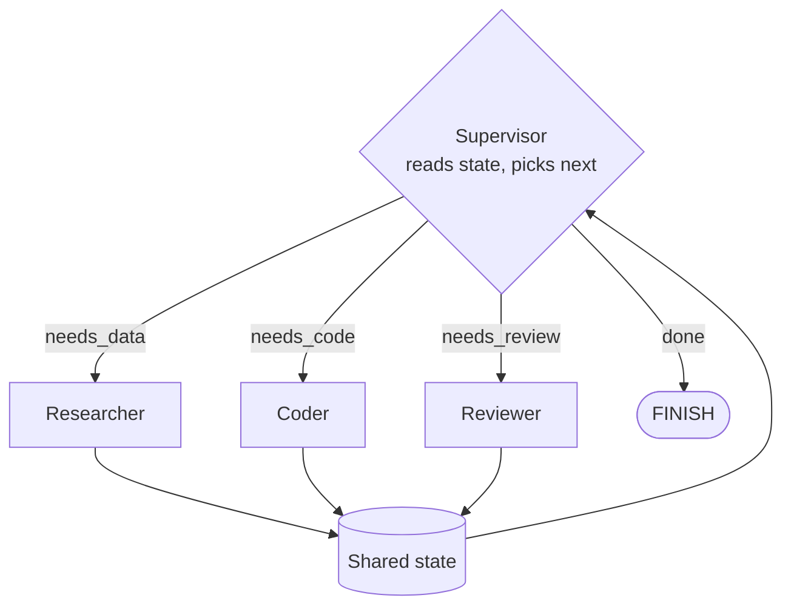

# The Supervisor Pattern

A router agent dynamically selects which worker to invoke based on the current state.

## How It Differs from Hierarchical
- **Hierarchical:** Manager plans all sub-tasks upfront, then delegates
- **Supervisor:** Router makes one decision at a time based on current state
- Supervisor is reactive; hierarchical is proactive

## Implementation with LangGraph
- Model the supervisor as a node that returns the name of the next node
- Each worker is a node that updates shared state
- Conditional edges route from supervisor to the selected worker
- After each worker completes, control returns to the supervisor

## Key Design Choice
The supervisor agent should use **structured output** (e.g., return `{"next": "coder", "task": "..."}`) rather than free-form text to make routing deterministic and parseable.

## Sources

- [LangGraph Documentation (LangChain)](https://langchain-ai.github.io/langgraph/)
