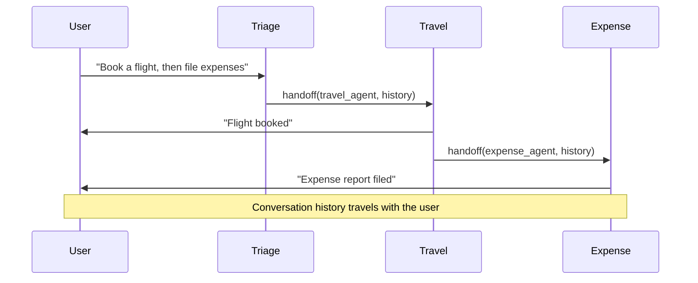

# Swarm Pattern — Dynamic Agent Handoffs

Agents hand off control to each other based on conversation context. No central coordinator.

## Key Properties
- **No central router** — each agent decides when to hand off and to whom
- **Conversation history travels** with the user across handoffs
- Each agent declares which other agents it can hand off to
- Handoff is implemented as a tool call: `handoff(agent_name, context)`

## The Claude Agent SDK Approach
- Agents define `handoffs` — a list of agents they can transfer to
- When an agent calls a handoff tool, the SDK swaps the active agent
- The new agent receives the full conversation so far
- Natural for customer-service-style flows where the user drives the conversation

## When to Use
- Conversational systems where the user's needs shift mid-session
- Each agent "owns" a domain (billing, tech support, sales)
- You want the system to feel like one seamless conversation

## Sources

- [Claude Agent SDK (Anthropic)](https://github.com/anthropics/claude-agent-sdk-python)
- [OpenAI Swarm (Experimental)](https://github.com/openai/swarm)
