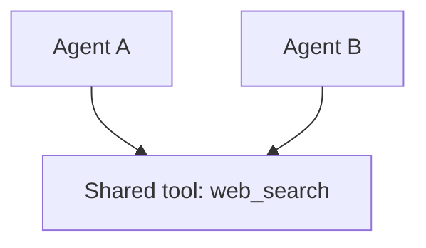
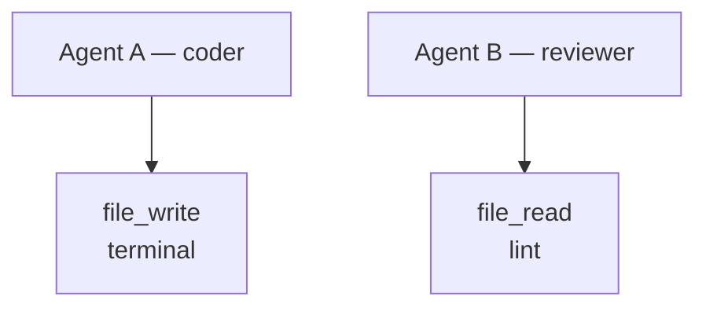

# Tool Sharing vs. Tool Isolation

## Share Tools When...
- Multiple agents need to read from the same data source
- Tools are stateless and safe to call concurrently (e.g., `web_search`)
- You want to reduce configuration duplication
- The tool is a read-only query (database lookups, API reads)
- Example: Both researcher and fact-checker share the `web_search` tool

**Shared tool architecture:**

## Isolate Tools When...
- The tool has side effects (file writes, API mutations, sending messages)
- Agents operate on different resources and shouldn't see each other's work
- You need to enforce permissions (coder can write code, reviewer cannot)
- The tool maintains state between calls (database connections, sessions)
- Example: Only the coder agent gets `file_write`; the reviewer only gets `file_read`

**Isolated tool architecture:**

---

**Rule of thumb:** Read-only tools can be shared. Write tools should be isolated to the agent responsible for that action.
