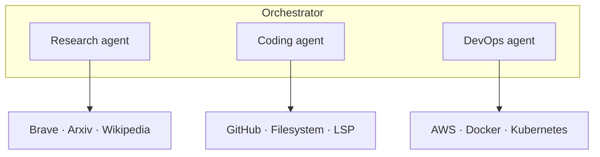

# MCP in Multi-Agent Systems

Each agent connects to its own set of MCP servers, giving it access to domain-specific tools.



## Why MCP Fits Multi-Agent Naturally
- MCP provides a **standard protocol** for tool discovery and invocation
- Each agent can spin up its own MCP server connections independently
- Agents get tool descriptions automatically — no manual tool schema wiring
- Adding new capabilities = adding a new MCP server, not changing agent code

## Architecture Pattern: Agent + MCP Config
```yaml
agents:
  researcher:
    model: claude-sonnet-4-20250514
    mcp_servers:
      - brave-search
      - arxiv-reader
  coder:
    model: claude-sonnet-4-20250514
    mcp_servers:
      - github
      - filesystem
      - terminal
  devops:
    model: claude-sonnet-4-20250514
    mcp_servers:
      - aws-cli
      - docker
```

## Key Benefit
Each agent only "sees" the tools from its MCP servers. The researcher cannot accidentally run shell commands. The coder cannot accidentally search the web. **Tool isolation through MCP server assignment.**

## Sources

- [Model Context Protocol Specification (Anthropic)](https://modelcontextprotocol.io/specification/2025-11-25)
- [Introducing the Model Context Protocol (Anthropic, 2024)](https://www.anthropic.com/news/model-context-protocol)
