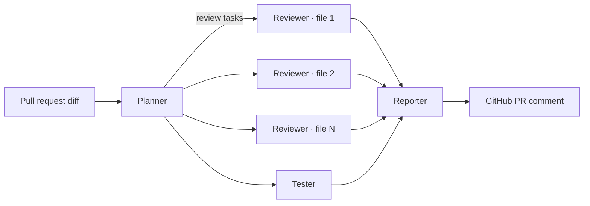

# Example: Automated Code Review Pipeline

## Step 1: Planner Agent
- **Input:** Pull request diff and description
- **Action:** Analyzes the scope of changes and creates a review plan
- **Output:** List of review tasks: "Check error handling in auth.py", "Verify SQL query safety in db.py", "Review test coverage for new endpoints"
- **Tools:** `github_pr_diff`, `file_read`

## Step 2: Reviewer Agent (runs in parallel per file)
- **Input:** One file diff + review instructions from planner
- **Action:** Reviews code for bugs, style issues, security concerns, and performance
- **Output:** Structured review comments with severity (critical / warning / suggestion)
- **Tools:** `file_read`, `grep_codebase` (to check related code)

## Step 3: Tester Agent
- **Input:** The changed files and existing test suite
- **Action:** Runs existing tests, checks coverage, suggests missing test cases
- **Output:** Test results + list of recommended new tests
- **Tools:** `run_tests`, `coverage_report`

## Step 4: Reporter Agent
- **Input:** All reviewer comments + test results
- **Action:** Synthesizes findings into a single coherent review
- **Output:** PR comment with organized feedback, prioritized by severity
- **Tools:** `github_post_comment`

---

**Why multi-agent here?** A single agent reviewing a large PR would run out of context. Parallelizing reviewers across files keeps each one focused and fast. The reporter ensures the human sees one clean summary, not four separate dumps.
